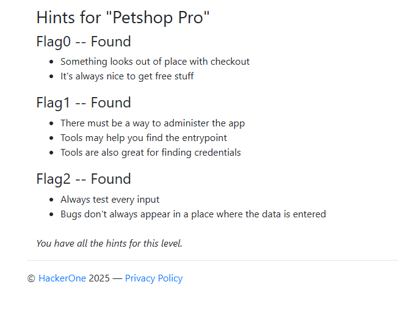
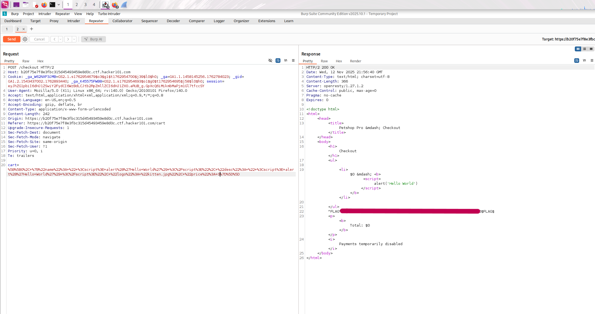
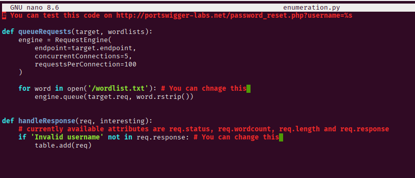
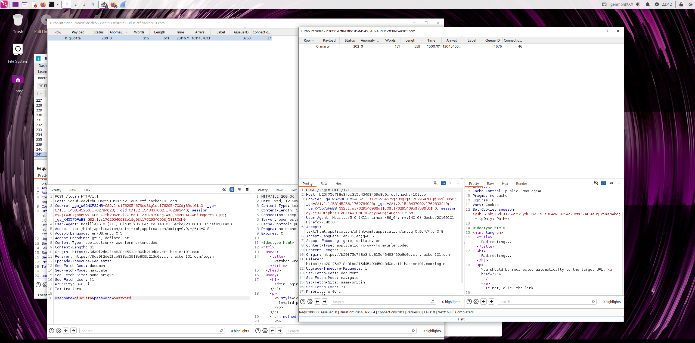
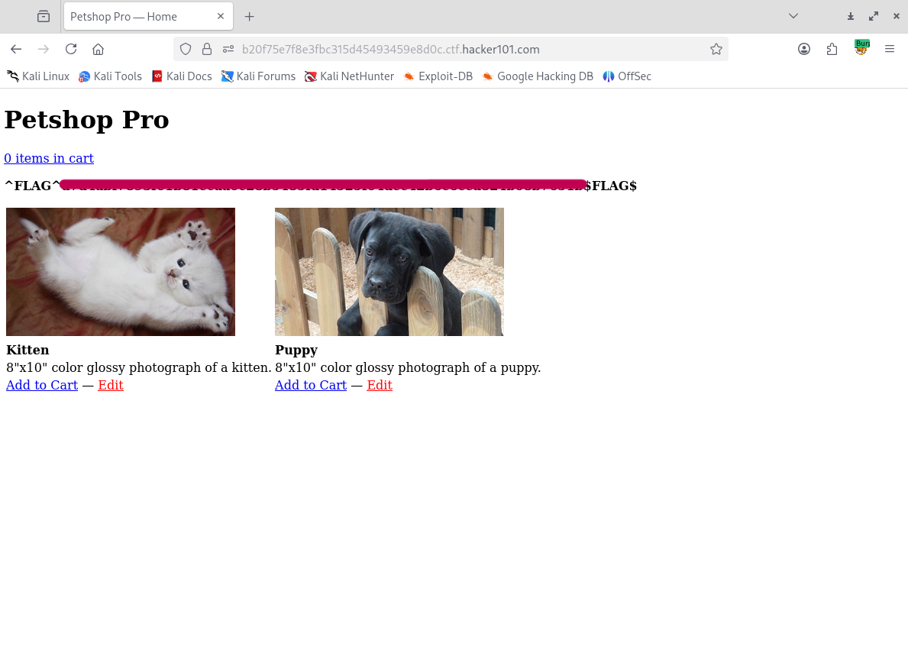
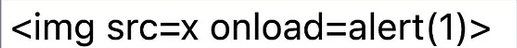
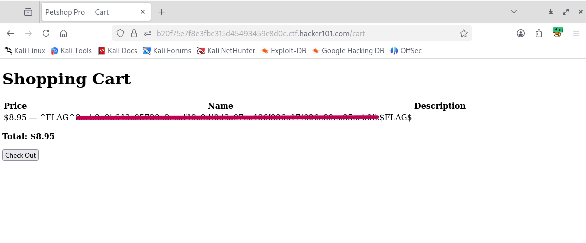

This is my first Hacker101 walkthrough, for educational purposes I will not reveal my flags, but I gonna show you how you can reach it, what steps I have done. (Unfortunately, I have not made a screenshot of everything.) 

During this challenge, I had some issues with 1 flag, but after a while (2 days of hard work, testing new techniques), I got all 3 flags.

It was a very fun challenge, I pretty enjoyed it, it was a bit time-consuming for one point. 
The tools that I used for this room: 
- Kali Purple (2025.3)
- Burpsuite CE + Turbo Intruder
- Mozilla Firefox + Proxy Foxy 

Don't let the easy sign in the room fool you. :)

This is all 7 hints for those 3 flags below.  

# **Flag0**

I fired up my Burpsuit + Mozilla + FoxyProxy combo, I put the picture in the cart, then I sent this request to the repeater. 
Here on the request side (left), I simply deleted the price of the picture, then I sent the request. 
On the response side(right), if you were doing well, you got your first flag for "free" and we like the free things. :) 

# **Flag1**

Here comes the fun and patience time. 

The hints of this flag said there must be an administrator app, probably there is a login side, so I simply put **/login** after the URL, and voila, there is a login side. 
I caught the login request in the Burp Suite, then I sent it to the repeater here. I tried a couple of basic username/password combos, but nothing worked. 
Next step, I tried to use the basic intruder. I spent almost 2 whole days finding the username/password combo, but it felt like I had to sit here forever to find at least the username. 
Next step, I tried to use the Hydra, but unfortunately, I only got false-positive notifications. NOTHING WORKED.

I do some research to find a better way to get at least the username, then I find the Intruder Turbo extension for Burp Suite (you can download it from the store).

I used this script to get a username and after the password (you can just change the green marks) 

Finally, AFTER 2 DAYS OF SUFFERING (I used the regular intruder with many usernames and password lists), I got both username and password, and it worked.

I logged in, and here we go, our second flag. 

# **Flag2**

After the hints, I had a feeling... There is something wrong with those pictures. 
I clicked on the edit button, then I simply tried one XSS payload on the name field:   

Save it, then I went back to the cart, and my last flag was waiting for me there. :)

