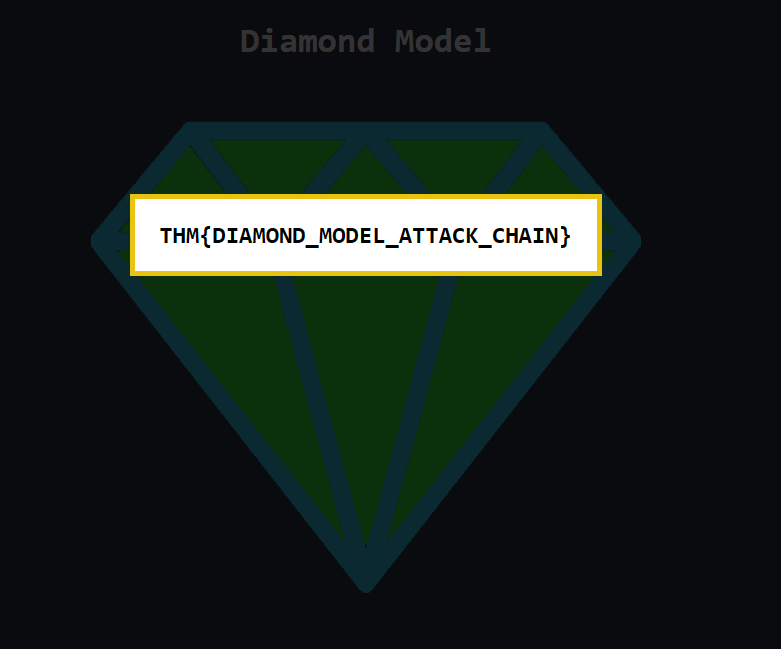

# **Introduction**

What is The Diamond Model?

The Diamond Model of Intrusion Analysis (Caltagirone, Pendergast, Betz – 2013) is a framework used in cybersecurity to understand and analyze intrusions.

It has four core features: Adversary, Infrastructure, Capability, Victim, arranged like a diamond to show how they are connected.

It also considers Social, Political, and Technological aspects as extra dimensions.

The model helps analysts connect events, classify attacks, track campaigns, and anticipate adversary actions.

It is useful both for technical analysis (correlating data, defending networks) and for explaining incidents to non-technical audiences.

In short:
The Diamond Model gives a structured way to break down intrusions, link threat actor activity, and communicate findings clearly.

# **Adversary**

Who is an Adversary?

In the Diamond Model, an adversary is the actor or organization behind a cyberattack. They use capabilities against victims to achieve their goals.

* Adversary Operator: the hacker(s) carrying out the intrusion.
* Adversary Customer: the person or group benefiting from the attack, who may direct one or more operators.

At first, adversaries are often hard to identify. Over time, analyzing incident data, signatures, and other evidence can reveal who they are.

In short:
An adversary is the threat actor behind an intrusion, either directly (operator) or indirectly (customer).

What is the term for a person/group that has the intention to perform malicious actions against cyber resources?

Adversary Operator

What is the term of the person or a group that will receive the benefits from the cyberattacks?

Adversary Customer

# **Victim**

In the Diamond Model, the victim is the target of an adversary. This can be a person, organization, system, email address, domain, IP, or other asset. There is always a victim in any cyberattack.

Victim Personae: the people or organizations being targeted (e.g., company, individual, job role, industry).

Victim Assets: the technical resources being attacked (e.g., systems, networks, accounts, IPs).

Example: In a spear-phishing attack, the company employee who clicks the link is the victim, while their email address or computer are the victim assets.

In short:
A victim is the adversary’s target, split into who is attacked (persona) and what is attacked (assets).

What is the term that applies to the Diamond Model for organizations or people that are being targeted?

Victim Personae

# **Capability**

In the Diamond Model, capability refers to the skills, tools, and techniques (TTPs) an adversary uses in an attack.

* Can range from simple methods (e.g., password guessing) to advanced techniques (e.g., custom malware).
* Capability Capacity: vulnerabilities or exposures that a capability can exploit.
* Adversary Arsenal: the full set of an adversary’s capabilities.

An adversary needs either the skills to create capabilities (like malware or phishing) or access to them (e.g., malware-as-a-service).

In short:
A capability is the adversary’s tools and methods, individually or as part of their broader arsenal.

Provide the term for the set of tools or capabilities that belong to an adversary.

Adversary Arsenal

# **Infrastructure**

In the Diamond Model, infrastructure is the physical or logical systems an adversary uses to deliver or control their capabilities. This can include hardware, software, IPs, domains, email addresses, C2 servers, or even malicious USBs.

* Type 1 Infrastructure: directly controlled or owned by the adversary.
* Type 2 Infrastructure: controlled by an intermediary to hide the adversary’s identity (e.g., compromised servers or domains).
* Service Providers: organizations supporting the adversary’s infrastructure (e.g., ISPs, registrars, webmail).

In short:
Infrastructure is the network, systems, and tools an adversary uses to execute and manage attacks, either directly or indirectly.

To which type of infrastructure do malicious domains and compromised email accounts belong?

Type 2 Infrastructure

What type of infrastructure is most likely owned by an adversary?

Type 1 Infrastructure

# **Event Meta Features**

Meta-features are optional attributes that add extra intelligence to an event in the Diamond Model. Six common meta-features:

* Timestamp – Date and time of the event, useful for spotting patterns and time-zone insights.
* Phase – The stage of the intrusion 
  1. Reconnaissance 
  2. Weaponization 
  3. Delivery 
  4. Exploitation 
  5. Installation 
  6. Command & Control 
  7. Actions on Objective).
* Result – Outcome of the event: success, failure, or unknown; can relate to the CIA triad (Confidentiality, Integrity, Availability).
* Direction – Flow of the attack, e.g., Victim→Infrastructure, Infrastructure→Victim, Adversary→Infrastructure, or bidirectional.
* Methodology – General classification of the attack, e.g., phishing, DDoS, breach, port scan.
* Resources – External requirements for the intrusion, such as software, knowledge, information, hardware, funds, facilities, or access.

In short:
Meta-features give extra context about when, how, and with what resources an adversary conducted an intrusion, helping analysts understand patterns and plan defenses.

What meta-feature does the axiom "Every malicious activity contains two or more phases which must be successfully executed in succession to achieve the desired result" belong to? 

Phase

You can label the event results as "success", "failure", and "unknown". What meta-feature is this related to?

Result

To what meta-feature is this phrase applicable "Every intrusion event requires one or more external resources to be satisfied prior to success"?

Resources

# **Social-Political Component**

In the Diamond Model, the social-political component captures the adversary’s needs and intent, such as financial gain, reputation in hacker communities, hacktivism, or espionage.

Example: A victim’s computing resources might be used in a botnet for crypto mining, providing a product that the adversary exploits for financial benefit.

In short:
This component explains why an adversary conducts an attack and what they hope to achieve.

# **Technology Component**

In the Diamond Model, the technology component shows the relationship between capability and infrastructure, illustrating how the adversary operates and communicates.

Example: In a watering-hole attack, the adversary compromises legitimate websites that the target is likely to visit.

In short:
This component explains how the adversary executes attacks using their tools and infrastructure.

# **Practice Analysis**

Are you ready to construct the Diamond Model? Please, deploy the static site attached to this task and dive into the case study and extract the information needed to populate our Diamond Model. 

(Please note: The case study for this room occurred in 2015, and is not in light of recent developments in Ukraine). 

Complete all eight areas of the diamond. What is the flag that is displayed to you?

THM{DIAMOND_MODEL_ATTACK_CHAIN}

# **Conclusion**

The Diamond Model is a structured, scientific method for analyzing cyber intrusions. It helps you:

* Break down attacks into adversary, capability, infrastructure, and victim.
* Apply meta-features (timestamp, phase, result, direction, methodology, resources) for deeper context.
* Communicate findings clearly to non-technical audiences like executives, clients, or teams.
* Leverage real-time intelligence to defend networks and anticipate adversary actions.

In short:
The Diamond Model improves the accuracy, efficiency, and clarity of intrusion analysis while aiding strategic defense planning.

