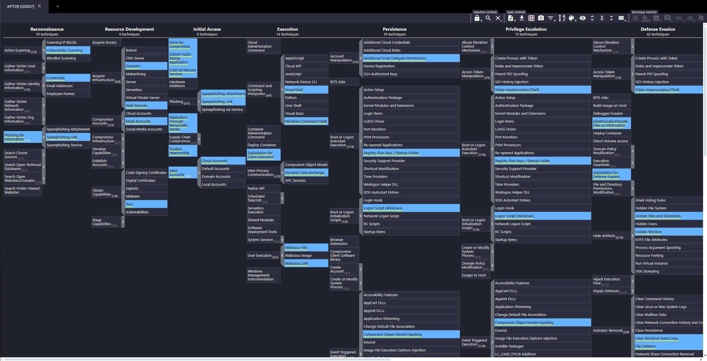

Sunny is a SOC analyst at E-corp, which manufactures rare earth metals for government and non-government clients. She receives a classified intelligence report that informs her that an APT group (APT28) might be trying to attack organizations similar to E-corp. To act on this intelligence, she must use the MITRE ATT&CK Navigator to identify the TTPs used by the APT group, to ensure it has not already intruded into the network, and to stop it if it has.

Please visit this [link](https://static-labs.tryhackme.cloud/sites/eviction/) to check out the MITRE ATT&CK Navigator layer for the APT group and answer the questions below.

Q1. 

What is a technique used by the APT to both perform recon and gain initial access?

Spearphishing link

Q2. 

Sunny identified that the APT might have moved forward from the recon phase. Which accounts might the APT compromise while developing resources?

Email accounts

Q3. 

E-corp has found that the APT might have gained initial access using social engineering to make the user execute code for the threat actor. Sunny wants to identify if the APT was also successful in execution. What two techniques of user execution should Sunny look out for? (Answer format: <technique 1> and <technique 2>)

Malicious file and malicious link

Q4. 

If the above technique was successful, which scripting interpreters should Sunny search for to identify successful execution? (Answer format: <technique 1> and <technique 2>)

Powershell and Windows Command shell

Q5. 

While looking at the scripting interpreters identified in Q4, Sunny found some obfuscated scripts that changed the registry. Assuming these changes are for maintaining persistence, which registry keys should Sunny observe to track these changes?

Registry run keys

Q6. 

Sunny identified that the APT executes system binaries to evade defences. Which system binary's execution should Sunny scrutinize for proxy execution?

Rundll32

Q7. 

Sunny identified tcpdump on one of the compromised hosts. Assuming this was placed there by the threat actor, which technique might the APT be using here for discovery?

Network sniffing

Q8. 

It looks like the APT achieved lateral movement by exploiting remote services. Which remote services should Sunny observe to identify APT activity traces?

SMB/Windows Admin shares

Q9. 

It looked like the primary goal of the APT was to steal intellectual property from E-corp's information repositories. Which information repository can be the likely target of the APT?

Sharepoint

Q10. 

Although the APT had collected the data, it could not connect to the C2 for data exfiltration. To thwart any attempts to do that, what types of proxy might the APT use? (Answer format: <technique 1> and <technique 2>)

external proxy and multi-hop proxy

