# **Introduction**

Cyber Threat Intelligence for SOC L1 Analysts
A modern Security Operations Centre (SOC) is a busy place: dashboards flashing, endless telemetry, and constant pressure to catch the next breach. At the centre of this noise sits the Level 1 analyst—the first human filter for every alert, pop-up, or suspicious packet.

This module connects Cyber Threat Intelligence (CTI) to daily SOC work: enriching indicators, triaging alerts, and turning raw data into meaningful stories.

Learning objectives
By the end, learners will move from “I can spot an IP address” to “I can explain why this IP address is a threat—and back it up.” Specifically, you will:

* Understand what threat intelligence is and its value to SOC analysts
* Learn the intelligence lifecycle and key indicators to track
* Explore intelligence sharing via feeds and platforms

Prerequisites
Before starting, complete:

[Cyber Security 101](https://tryhackme.com/path/outline/cybersecurity101)

# **Cyber Threat Intelligence**

From Alert Overload to Informed Action
A junior analyst logs in and finds 200 alerts waiting—ranging from harmless scans to a suspicious PowerShell beacon. The queue won’t slow down; it requires fast, confident decisions. This is where Cyber Threat Intelligence (CTI) proves its value.

CTI provides the context to identify which alerts signal real danger. With solid context, the SOC focuses on what matters—and rests easier once dashboards quiet down.

CTI helps answer three core questions:

* Who or what triggered this indicator?
* What is their past behaviour?
* How should my organisation respond right now?

When these questions are resolved quickly—ideally within minutes—L1 analysts give incident-response teams a crucial head start. CTI is not just for intel specialists; it is a front-line tool that turns triage from guesswork into informed action.

**From Raw Data to Intelligence**

Security discussions often blur data, information, and intelligence. Clarifying these terms sharpens the analyst’s goal: transforming raw data into actionable intelligence.

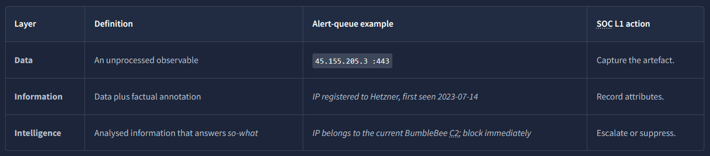

From Artefacts to Intelligence

A Level 1 analyst’s role is to make artefacts usable: enriching them until they become intelligence—or proving they never will. This is done through rapid, structured lookups across public, commercial, and internal sources, revealing origin, behaviour, and relevance.

Key Labels in the Data-to-Intelligence Journey

* IOC (Indicator of Compromise): Evidence of a breach, e.g. a C2 address in logs
* IOA (Indicator of Attack): Malicious activity in progress, e.g. PowerShell launching an unknown service
* TTP (Tactics, Techniques, and Procedures): Adversary methods, mapped to MITRE ATT&CK IDs and descriptions

**Indicators in First-Line Triage**

Every artefact needs a tailored enrichment approach. The priority is not memorising tools, but recognising the indicator type and knowing where to investigate.

A table follows with indicator types and examples.

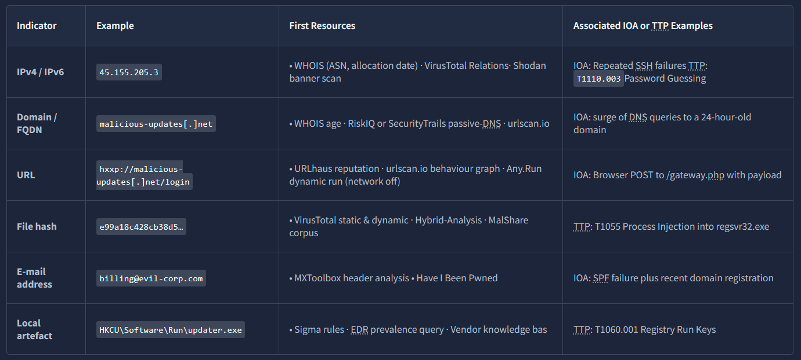

Actionable Tip
Keep a bookmark folder or SIEM launcher that opens your preferred lookups with the indicator pre-filled. Saving 30 seconds per alert compounds into hours over a month.

**Feeds vs. Platforms**

Most SOCs don’t generate intelligence in-house—they rely on external sources.

* Feed: A scheduled stream of indicators (CSV, JSON, STIX, TAXII). Too many unfiltered feeds cause false positives and erode trust.
* Platform: A repository for storing, enriching, mapping, and sharing indicators (e.g. [MISP](https://tryhackme.com/room/misp), [OpenCTI](https://tryhackme.com/room/opencti)).

Best practice: introduce feeds gradually, validate against your threat model, and promote into the platform only after proving actionability. The platform then serves as the single source of truth for analysts.

**Sources of CTI**

An indicator’s credibility depends on its source. Analysts must always record where intelligence originated.

* Internal telemetry: SIEM logs, EDR alerts, phishing submissions → highest relevance
* Commercial services: Premium feeds, paid sandboxes, vendor analytics → high fidelity, but license restrictions
* Open-source intelligence (OSINT): AbuseIPDB, URLhaus, public blogs, research → valuable, but requires cross-confirmation
* Communities & ISACs: Sector-specific groups with rich, labelled context (e.g. FS-ISAC)

**Threat Intelligence Classifications**

Threat intel links your environment to adversary behaviour. It is commonly grouped into four levels:

* Strategic: High-level trends for business/risk decisions (e.g. ransomware trend reports)
* Tactical: Adversary TTPs, often mapped to MITRE ATT&CK (e.g. advisory on new T1059.005 abuse)
* Operational: Campaign-specific insights on motives and intent (targets, assets, methods)
* Technical: Atomic indicators like IPs, domains, hashes

**L1 analyst focus**:

* Escalate Technical IOCs
* Observe & document Tactical IOAs
* Identify patterns feeding Operational reporting

What does CTI stand for?

Cyber Threat Intelligence

IP addresses, Hashes and other threat artefacts would be found under which Threat Intelligence classification?

Technical Intel

# **CTI Lifecycle**

The CTI Lifecycle
Cyber Threat Intelligence follows a six-phase cycle that turns raw data into contextual, actionable insights for incident triage. We’ll walk through this lifecycle as a narrative, following Alex—a SOC Level 1 analyst—on their task of protecting TryHatMe’s production database.

Before the Lifecycle: Key Concepts

**Traffic Light Protocol (TLP)**

The TLP, defined by FIRST.org, is a four-colour labelling system that specifies how widely intelligence can be shared. You’ll use it to guide proper handling and distribution of CTI.

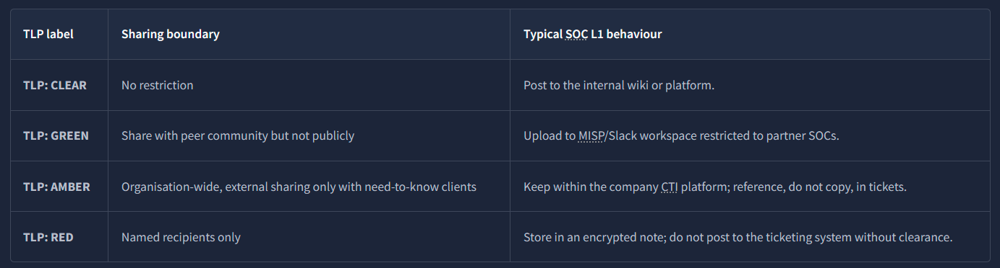

While investigating breaches, a Level 1 analyst must ensure that any IOC’s TLP label—if present—travels with the indicator into platforms and triage notes. Ignoring or violating the label risks breaching contracts and eroding trust with intelligence partners.

**Intel Formats**

Threat intelligence appears in multiple formats and protocols. Once gathered, analysts must share and update colleagues on new attack techniques. A common standard is Structured Threat Information Expression (STIX)—a JSON-based schema designed to describe indicators, relationships, and context in machine-readable form.

**Scenario Premise**

TryHatMe Corp stores sensitive customer data in a PostgreSQL server on a segmented subnet. The server is protected by a next-generation firewall (NGFW) and an Endpoint Detection & Response (EDR) agent. Senior management tasks the SOC with “bringing in cyber threat intelligence” so these controls can react quickly to emerging threats. Morning-shift L1 analyst Alex is assigned to design and test this workflow.

**Step 1: Direction – Defining the Mission**

Alex begins with a short planning session alongside the CTI lead and the database administrator. They refine the mandate into a concrete requirement:

1. Primary asset: PostgreSQL production database
2. Business risk: GDPR fines and customer trust loss from a data breach
3. Available controls: NGFW (IP/domain blocking), EDR (file hash quarantine)
4. Initial CTI goal:
* Block/alert on suspicious IPs and domains at the firewall
* Detect known malicious hashes at the EDR layer

Alex formulates two guiding questions:

Q1: Which external IPs/domains are currently used to exploit PostgreSQL or exfiltrate data?

Q2: Which malware families targeting PostgreSQL drivers or credentials are active this week, and what are their hashes?

These questions define success criteria for later feedback.

**Step 2: Collection – Assembling the Raw Material**

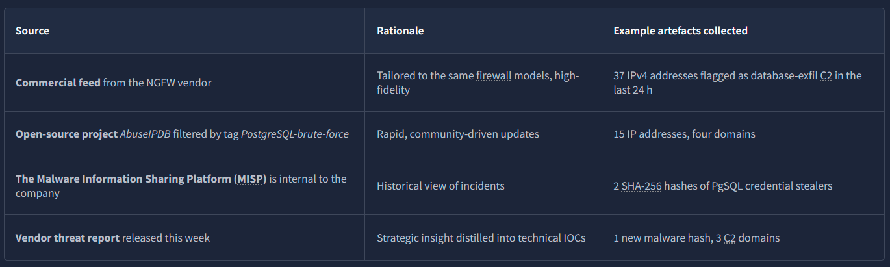

Alex exports each feed in STIX or CSV, then stores a dated copy in the SOC's "raw-intel" S3 bucket, ensuring reproducibility.

**Step 3: Processing – Normalising and Correlating the Data**

Raw feeds arrive in mixed formats and must be standardised and linked before use. Processing ensures consistency, removes duplicates, and surfaces contradictions.

For Alex this means running scheduled scripts to:

* Normalise indicator syntax (e.g., compress IPv6, lowercase domains, strip subnet masks).
* Correlate and deduplicate against the platform’s indicator table.
* Tag each record with source, date, and TLP.
* Export action files for enforcement, e.g. firewall_blocklist.csv (indicator, action, comments) and edr_hash_rules.yar (hash rules).

Example policy decision: when feeds conflict on TLP (NGFW feed shows TLP:AMBER, AbuseIPDB shows TLP:CLEAR), inherit the stricter label (TLP:AMBER) to avoid accidental over-sharing.

**Step 4: Analysis – Turning Information Into Judgement**

Blanket blocking increases false positives. Analysis answers the mission questions from Step 1 by validating relevance and impact before enforcement.

Alex’s analysis workflow:

* Validate firewall indicators (Q1): query logs (e.g., Splunk) for recent activity. Finding: an NGFW IP attempted — but failed — to open TCP/5432 against the production subnet → indicator is applicable.
* Validate hash indicators (Q2): check context in intel platforms and sandboxes. Finding: OpenCTI links the hash to PgSteal; Any.Run shows credential-dump behaviour. Because the org uses the exact ODBC driver targeted, the hash is escalated as high priority.

Outcome: prioritise indicators that both match observed telemetry and threaten known assets; mark others for monitoring or further enrichment to reduce false positives.

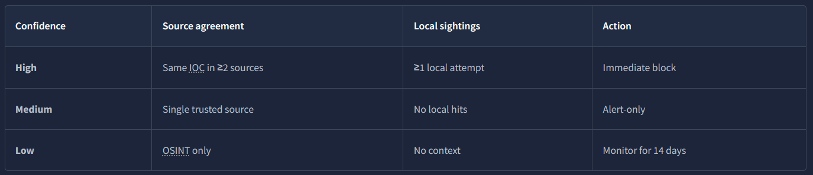

Seven IP addresses and one hash meet the high bar; the rest are queued as medium and set for monitoring.

**Step 5: Dissemination – Getting Intelligence to the Right Consumers**

Two weeks later, metrics and reports from the firewall and EDR reports show the progress of establishing an effective threat intelligence workflow:

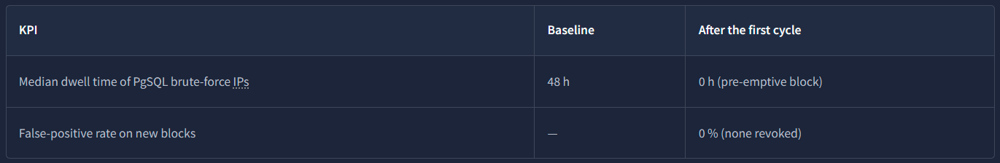

Because the outcome meets the initial direction objectives, management approves expansion: the next sprint will add other threat parameters, such as DNS tunnelling IOCs for the same asset group. Alex updates the direction document, closes the feedback loop, and schedules the second iteration.

At which phase of the CTI lifecycle is data converted into usable formats through sorting, organising, correlation and presentation?

Processing

During which phase do security analysts get the chance to define the questions to investigate incidents?

Direction

# **CTI Standards & Frameworks**

Standards and frameworks provide structures to rationalise the distribution and use of threat intel across industries. They also allow for common terminology, which helps in collaboration and communication. Here, we briefly look at some essential standards and frameworks commonly used.

**MITRE ATT&CK**

A malicious PowerShell command may look obvious, but your ticket needs a label everyone else recognises. MITRE's ATT&CK framework supplies that label. Each technique—T1059.001 PowerShell, T1048.003 DNS tunnel, and so on—acts as a Rosetta Stone between vendors, teammates, and auditors, providing knowledge about adversarial behaviour.

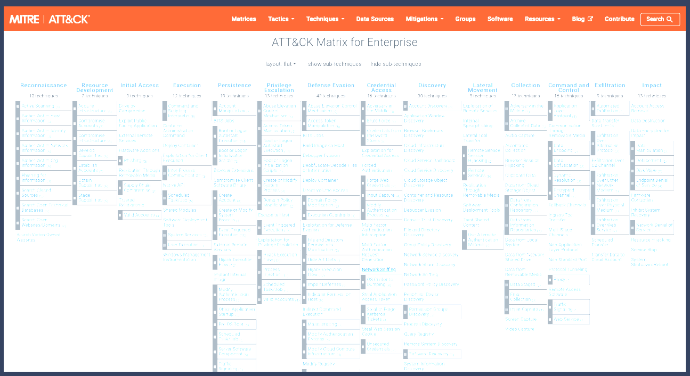

As an L1 analyst, you can use the matrix during an investigation in the following way:

1. Match the behaviour in the alert to a tactic/technique pair.
2. Write the ID in your triage note: "Observed T1071.001 (web-based C2) against FINANCE-TRYHATME-00".
3. Hand the note to Level 2 or Incident Response; they instantly know which mitigations and threat-actor profiles apply.

**MITRE D3FEND**

If ATT&CK catalogues how adversaries attack, D3FEND catalogues how defenders respond. Each entry maps to defensive tactics such as Credential Hardening or Data Obfuscation_._

A case for this would look similar to this:

* Your proxy raises a T1048.003 DNS tunnel alert.
* Search D3FEND for the matching defensive technique: D3—NTDN DNS—request analysis. The page lists practical controls: block extensive TXT records and alert on uncommon query entropy.
* Add the most feasible control to your "next actions" field; you have just supplied a mitigation, not only a diagnosis.

**Cyber Kill Chain**

The Cyber Kill Chain, developed by Lockheed Martin, breaks down adversary actions into steps. This breakdown helps analysts and defenders identify which stage-specific activities occurred when investigating an attack. The phases defined are shown in the image below.

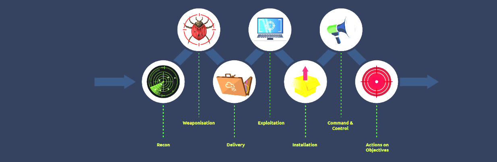
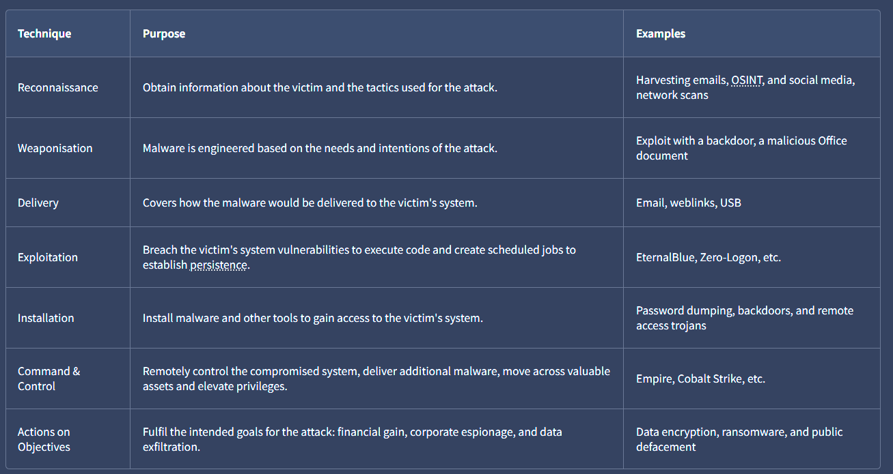

Over time, the kill chain has been expanded using other frameworks, such as ATT&CK, and a new Unified Kill Chain has been formulated.

**CVEs, CVSS, and the NVD**

A SOC queue contains almost as many vulnerability notifications as malware alerts. As an SOC L1 analyst, you must understand how to identify and organise vulnerability notifications.

* CVE (Common Vulnerabilities and Exposures) — provides a catalogue number for discovered vulnerabilities, e.g., CVE-2023-4863.
* CVSS (Common Vulnerability Scoring System) — a 0–10 severity scale with temporal and environmental modifiers for vulnerabilities.
* NVD (National Vulnerability Database) — the canonical repository that links CVE numbers to CVSS scores, exploits, and affected products.

**Sharing and Processing Intel**

We previously discussed platforms and feeds from which threat intelligence can be retrieved. When organisations publish fresh indicators, every peer that consumes and validates them strengthens the collective defence and feeds back improvements. This information looks to hinge on two standards: STIX and TAXII.

* STIX: We mentioned STIX previously as the structured JSON schema for describing threat information.
* TAXII: The Trusted Automated eXchange of Indicator Information is a set of secure APIs used to exchange threat intelligence in near real-time for detection, prevention, and mitigation of threats.
It supports two sharing models: Collection, which ensures threat intel is collected and hosted by a producer, and Channel, which publishes threat intel to users from a central server.

Sharing threat intelligence has its benefits, with near-real-time feeds shortening the gap between another organisation's incident and one's preventive procedures. Additionally, community contributions earn organisations reciprocal trust as valuable intelligence sources.

That said, not every indicator should be shared. Privacy laws, customer NDAs or internal competitive information may forbid disclosure, and sharing specific IOCs early can tip off adversaries that their campaign has been detected.

What sharing models are supported by TAXII?

Collection and Channel

When an adversary has obtained access to a network and is extracting data, what phase of the kill chain are they on?

Actions on Objectives

# **Practical Analysis**

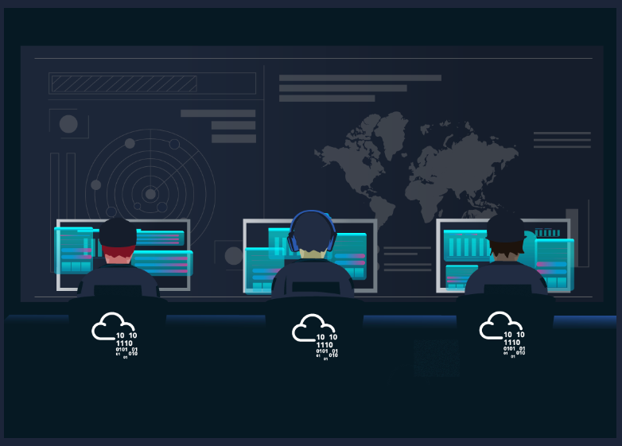

As part of the dissemination phase of the lifecycle, CTI is also distributed to organisations using published threat reports. These reports come from technology and security companies researching emerging and actively used threat vectors. They are valuable for consolidating information presented to all suitable stakeholders. Some notable threat reports come from [Mandiant](https://www.mandiant.com/resources), [Recorded Future](https://www.recordedfuture.com/resources/global-issues) and [Palo Alto Unit42](https://unit42.paloaltonetworks.com/category/threat-research/).

All the things we have discussed come together when mapping out an adversary based on threat intel. To better understand this, we will analyse a simplified engagement example. Click on the green "View Site" button in this task to open the Static Site Lab and navigate through the security monitoring tool on the right panel, and fill in the threat details.

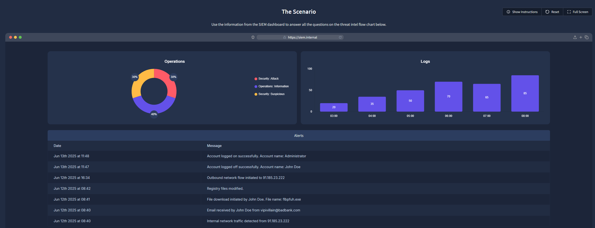
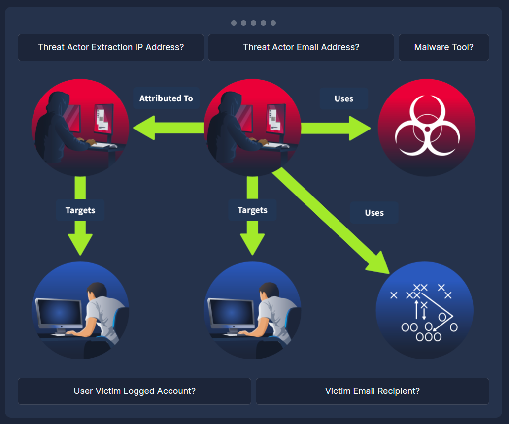

What was the source email address?

vipivillain@badbank.com

What was the name of the file downloaded?

flbpfuh.exe

Threat Actor Extraction IP Address?

91.185.23.222

Threat Actor Email Address?

vipivillain@badbank.com

Malware Tool

flbpfuh.exe

User Victim Logged Account?

Administrator

<sumamry>Victim Email Recipient?

John Doe

After building the threat profile, what message do you receive?

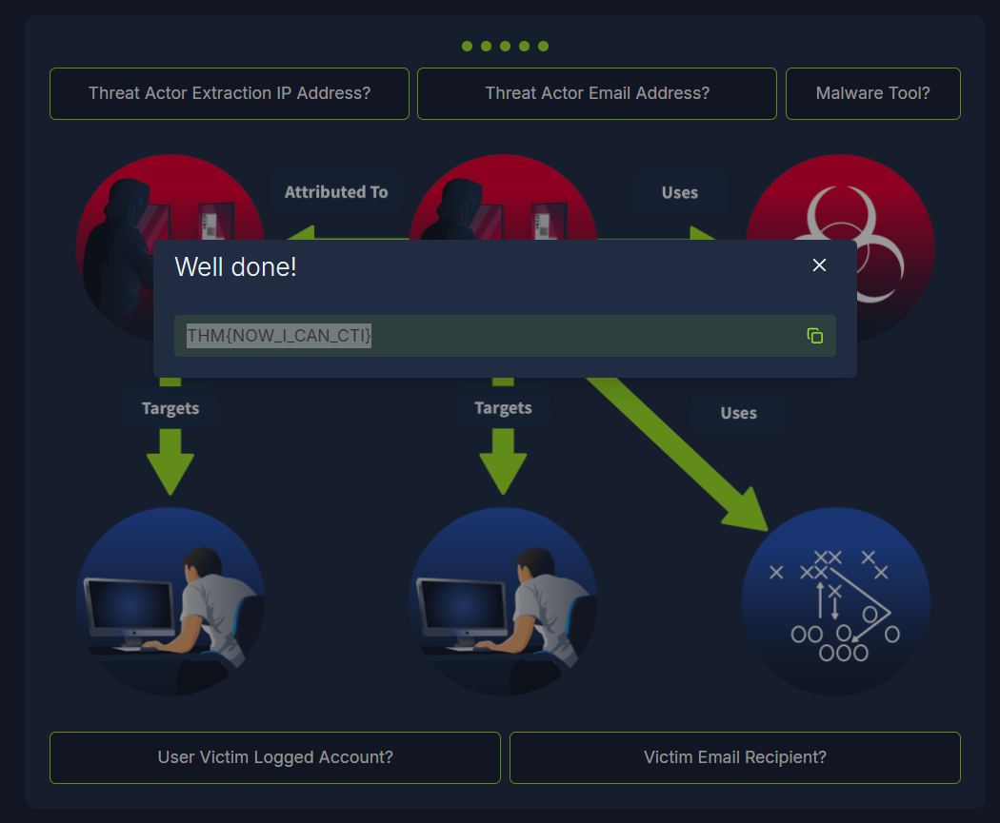
THM{NOW_I_CAN_CTI}

