# **Introduction to MITRE**

If you’re new to cybersecurity, you may not know MITRE. And if you’ve been around a while, you might only connect MITRE with CVEs (the list of [Common Vulnerabilities and Exposures](https://cve.mitre.org/), often checked when researching exploits).

But MITRE does much more. Beyond cybersecurity, it researches areas like AI, health informatics, and space security—all in support of safety and stability.

As [MITRE](https://www.mitre.org/about/corporate-overview) puts it: “We solve problems for a safer world. Through our federally funded R&D centers and public-private partnerships, we work across government to tackle challenges to the safety, stability, and well-being of our nation.”

In this room, we’ll look at MITRE’s key contributions to cybersecurity, including:

* ATT&CK® – Adversarial Tactics, Techniques, and Common Knowledge
* CAR – Cyber Analytics Repository
* ENGAGE – Guidance for defender–attacker engagement
* D3FEND – Defensive techniques framework
* AEP – ATT&CK Emulation Plans

Let’s dive in!

# **Basic Terminology**

Key Terms to Know

APT – Advanced Persistent Threat

* Refers to a threat group or nation-state conducting long-term attacks.
* Despite the name, they don’t always use “super-weapons” like zero-days.
* Most of their methods are common—and can be detected with the right defenses.
* Example: FireEye maintains an updated list of known [APT groups](https://www.fireeye.com/current-threats/apt-groups.html).

TTP – Tactics, Techniques, and Procedures

* Tactic = the attacker’s goal (what they want to achieve).
* Technique = the method used to reach that goal.
* Procedure = the specific way the technique is carried out.

Don’t worry if this feels abstract now—TTPs will become clearer as we go through examples in later sections.

# **ATT&CK® Framework**

What is the ATT&CK® Framework?

According to [MITRE, ATT&CK®](https://attack.mitre.org/) is a global knowledge base of adversary tactics and techniques based on real-world observations.

* Origins (2013): Began as an internal MITRE project called FMX (Fort Meade Experiment). Security pros simulated APT attacks against Windows networks, and data from those tests became the foundation of ATT&CK®.
* Growth: Originally focused on Windows, but now covers macOS, Linux, mobile, and cloud.
* Contributors: Built and updated through input from researchers and threat intel reports.
* Who uses it? Not just defenders (blue team)—attackers and red teams also use ATT&CK to simulate realistic techniques.

On the ATT&CK® [website](https://attack.mitre.org/), check out the ATT&CK Matrix for Enterprise.

* It’s organized into 14 categories (columns).
* Each column = a tactic (an attacker’s goal).
* Each cell = a technique (how the goal is achieved).
* Together, they map to the Cyber Attack Lifecycle (similar to the Lockheed Martin Kill Chain).

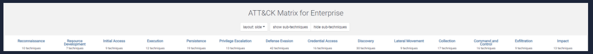 (ATT&CK Matrix v11.2)

Under  Initial Access , there are 9 techniques. Some of the techniques have sub-techniques, such as Phishing. 

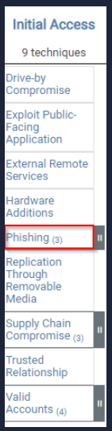

If we click on the gray bar to the right, a new layer appears listing the sub-techniques. 

Example: Phishing

When you click on Phishing in the ATT&CK Matrix, you’re taken to a dedicated page.
There you’ll find:

* Description – what phishing is and how it works
* Procedure Examples – real-world cases of attackers using it
* Mitigations – ways to defend against phishing

You can also use the Search feature in ATT&CK to quickly find details about any technique, sub-technique, or threat group.

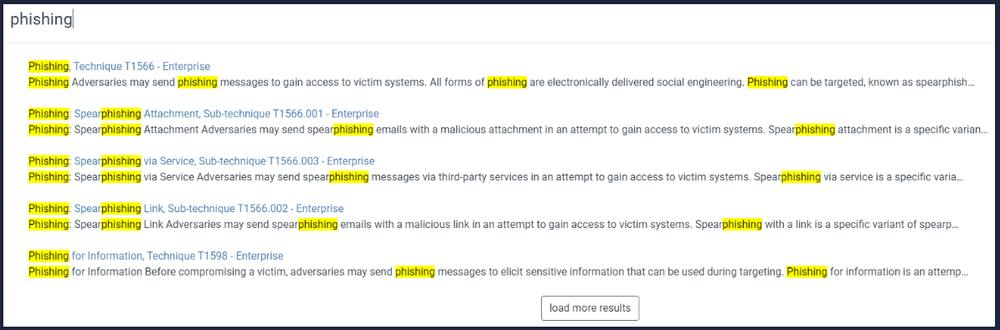

MITRE ATT&CK® Navigator

The ATT&CK® Navigator is a tool for exploring and annotating ATT&CK matrices.
It lets you:

* Visualize defensive coverage
* Plan red/blue team exercises
* Track how often techniques are seen or detected

You can access the Navigator from any group or tool page by clicking the ATT&CK Navigator Layers button.

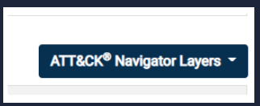

In the sub-menu select  view .

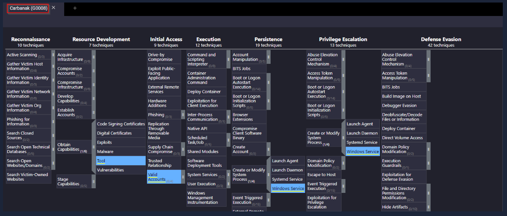

Getting Started with ATT&CK® Navigator

Click [here](https://mitre-attack.github.io/attack-navigator//#layerURL=https%3A%2F%2Fattack.mitre.org%2Fgroups%2FG0008%2FG0008-enterprise-layer.json) to view the Navigator for Carbanak.

At the top left, you’ll see three sets of controls:

* Selection controls – choose which data to view
* Layer controls – manage how layers are displayed
* Technique controls – filter or highlight techniques
* Explore each option to get familiar with the tool.

The question mark on the far right provides extra help and explanations.

Summary

* The ATT&CK Matrix helps map a threat group to their tactics and techniques.
* You can search or navigate the matrix in several ways.
* To practice, start with the [Phishing page](https://attack.mitre.org/techniques/T1566/).

Note: the link refers to version 8 of the ATT&CK Matrix.

Besides Blue teamers, who else will use the ATT&CK Matrix? (Red Teamers, Purpe Teamers, SOC Managers?)

Red Teamers

What is the ID for this technique?

T1566

Based on this technique, what mitigation covers identifying social engineering techniques?

User Training

What are the data sources for Detection? (format: source1,source2,source3 with no spaces after commas)

Application Log,File,Network Traffic

Which are the first two groups to have used spear-phishing in their campaigns? (format: group1,group2)

Axiom,Gold SOUTHFIELD

Based on the information for the first group, what are their associated groups?

Group 72

What software is associated with this group that lists phishing as a technique?

Hikit

What is the description for this software?

Hikit is malware that has been used by Axiom for late-stage persistence and exfiltration after the initial compromise.

This group overlaps (slightly) with which other group?

Winnti Group

How many techniques are attributed to this group?

15

# **CAR Knowledge Base**

[Cyber Analytics Repository](https://car.mitre.org/)

What is CAR?

The Cyber Analytics Repository (CAR) is MITRE’s knowledge base of security analytics, built on the ATT&CK® adversary model.

* It provides a data model and pseudocode for detection logic.
* Some analytics even include ready-to-use implementations (e.g., for Splunk or EQL).
* The focus: validated, well-documented analytics with clear explanations of how and why they work.

Example: [CAR-2020-09-001 – Scheduled Task File Access](https://car.mitre.org/analytics/CAR-2020-09-001/)

On the CAR page for this analytic, you’ll find:

* A short description of what it detects
* Links back to related ATT&CK items (technique, sub-technique, and tactic)

This shows how CAR connects analytics to the ATT&CK framework, helping defenders understand both the what and the why behind a detection.

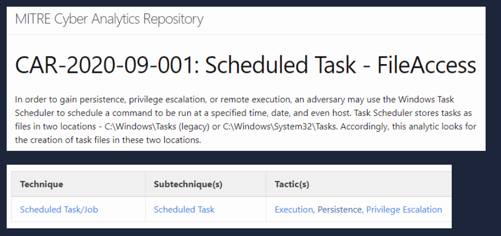

Pseudocode and Queries

Each CAR analytic also comes with:

* Pseudocode – a simple, human-readable description of the detection logic (what steps the system should follow).
* Example queries – for tools like Splunk, showing exactly how you could search for this behavior in real logs.

This way, you get both the concept (pseudocode) and the practical implementation (queries).

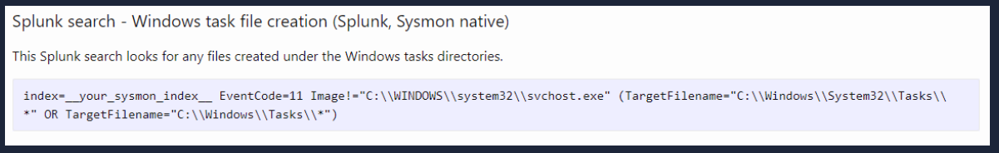

Sysmon and CAR

CAR often references [Sysmon](https://tryhackme.com/room/sysmon). If you’re not familiar, check out the Sysmon room first.

To get the most out of CAR, you can:

* Browse the [Full Analytic List](https://car.mitre.org/analytics)
* Explore the [CAR ATT&CK® Navigator](https://mitre-attack.github.io/attack-navigator/#layerURL=https://raw.githubusercontent.com/mitre-attack/car/master/docs/coverage/car_analytic_coverage_04_05_2022.json) layer to see all analytics in one place.

Full Analytic List
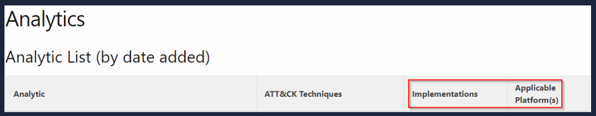

In the Full Analytic List, you can quickly see:

* Which implementations (e.g., Splunk, EQL) exist for each analytic
* Which OS platforms the analytic applies to

CAR ATTACK Navigator

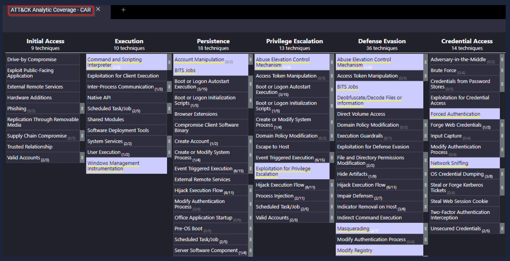
(The techniques highlighted in purple are the analytics currently in CAR)

Example: [CAR-2014-11-004 – Remote PowerShell Sessions](https://car.mitre.org/analytics/CAR-2014-11-004/)

This analytic shows:

* Pseudocode for the detection logic
* An EQL implementation (Event Query Language)

EQL (pronounced “equal”) is used to query, parse, and organize Sysmon event data.
You can read more about this [here](https://eql.readthedocs.io/en/latest/).

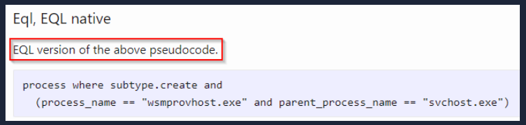

CAR goes beyond the basic Mitigation and Detection notes in ATT&CK®.

* It gives you detailed, validated analytics you can actually use.
* Think of it as a complement to ATT&CK®, not a replacement.

What tactic has an ID of TA0003?

Persistence

What is the name of the library that is a collection of Zeek (BRO) scripts?

BZAR

What is the name of the technique for running executables with the same hash and different names?

Masquerading

Examine CAR-2013-05-004, besides Implementations, what additional information is provided to analysts to ensure coverage for this technique?

Unit Tests

# **MITRE Engage**

MITRE Engage is a framework for planning and discussing adversary engagement operations.

Uses two main approaches:

* Cyber Denial – block the attacker’s ability to operate
* Cyber Deception – plant false artifacts to mislead them

The Engage website offers a [starter kit](https://engage.mitre.org/starter-kit/) with whitepapers, checklists, and processes to help you begin.

Like ATT&CK, Engage also has its own matrix to organize tactics and techniques.

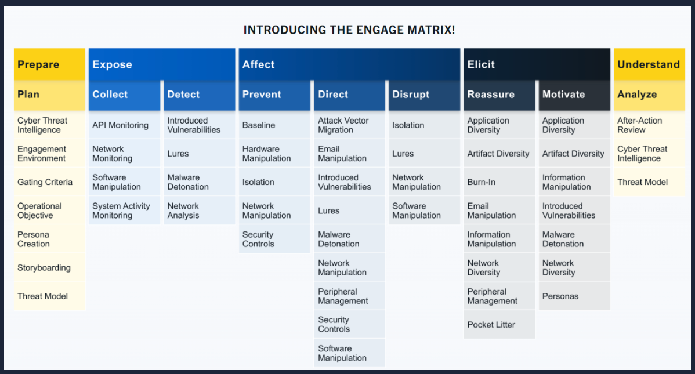
[(Source)](https://engage.mitre.org/)

MITRE Engage – Categories

* Prepare – Plan actions that lead to your desired outcome (input)
* xpose – Reveal adversaries when they trigger your deception
* Affect – Impact adversaries negatively to disrupt their operations
* Elicit – Gather info by observing adversary behavior (TTPs)
* Understand – Analyze the results of your actions (output)

Refer to the [Engage Handbook](https://engage.mitre.org/wp-content/uploads/2022/04/EngageHandbook-v1.0.pdf)  to learn more. 

The [Engage Matrix Explorer](https://engage.mitre.org/matrix) lets you interact with the matrix and filter using [ATT&CK](https://attack.mitre.org/) info.

* By default, it focuses on Operate, which includes Expose, Affect, and Elicit.

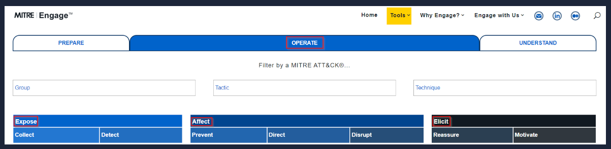

Under Prepare, what is ID SAC0002?

Persona Creation

What is the name of the resource to aid you with the engagement activity from the previous question?

Persona Profile Worksheet

Which engagement activity baits a specific response from the adversary?

Lures

What is the definition of Threat Model?

A risk assessment that models organizational strengths and weaknesses

# **MITRE D3FEND**

[D3FEND](https://d3fend.mitre.org/) is a knowledge graph of cybersecurity countermeasures.

* Still in beta, funded by the NSA Cybersecurity Directorate
* Stands for Detection, Denial, and Disruption Framework Empowering Network Defense
* Currently contains 408 artifacts in its matrix

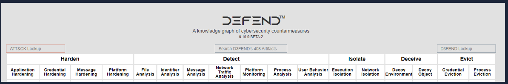

Let's take a quick look at one of the D3FENDs artifacts, such as  Decoy File . 

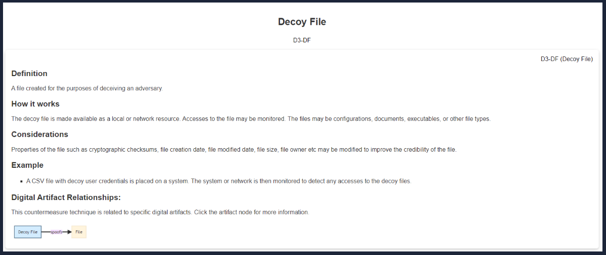

Using D3FEND

For each countermeasure, D3FEND provides:

* Definition – what the technique is
* How it works – how it functions
* Considerations – things to think about when implementing it
* Example – how to use it in practice
* You can filter by ATT&CK matrix like other MITRE resources.
* D3FEND is in beta, so it may change over time.
* The goal: be aware of this resource and check it as it evolves.

What is the first MITRE ATT&CK technique listed in the ATT&CK Lookup dropdown?

Data Obfuscation

In D3FEND Inferred Relationships, what does the ATT&CK technique from the previous question produce?

Outbound Internet Network Traffic

# **ATT&CK® Emulation Plans**

If these tools provided to us by MITRE are not enough, under  [MITRE ENGENUITY](https://mitre-engenuity.org/) , we have  Adversary Emulation Library , and ATT&CK ®  Emulation Plans .

CTID

MITRE formed an organization named The  [Center of Threat-Informed Defense](https://mitre-engenuity.org/cybersecurity/center-for-threat-informed-defense/)  ( CTID ). This organization consists of various companies and vendors from around the globe. Their objective is to conduct research on cyber threats and their TTPs and share this research to improve cyber defense for all. 

Some of the companies and vendors who are participants of CTID:

* AttackIQ (founder)
* Verizon
* Microsoft (founder)
* Red Canary (founder)
* Splunk

Per the website, " Together with Participant organizations, we cultivate solutions for a safer world and advance threat-informed defense with open-source software, methodologies, and frameworks. By expanding upon the MITRE ATT&CK knowledge base, our work expands the global understanding of cyber adversaries and their tradecraft with the public release of data sets critical to better understanding adversarial behavior and their movements. "

ATT&CK ®  Emulations Plans

The  [Adversary Emulation Library](https://medium.com/mitre-engenuity/introducing-the-all-new-adversary-emulation-plan-library-234b1d543f6b)  is a public library making adversary emulation plans a free resource for blue/red teamers. The library and the emulations are a contribution from CTID. There are several  [ATT&CK® Emulation Plans](https://github.com/center-for-threat-informed-defense/adversary_emulation_library)  currently available:  [APT3](https://attack.mitre.org/resources/adversary-emulation-plans/) ,  [APT29](https://github.com/center-for-threat-informed-defense/adversary_emulation_library/tree/master/apt29) , and  FIN6 .  The emulation plans are a step-by-step guide on how to mimic the specific threat group. If any of the C-Suite were to ask, "how would we fare if APT29 hits us?" This can easily be answered by referring to the results of the execution of the emulation plan. 

Review the emulation plans to answer the questions below. 

In Phase 1 for the APT3 Emulation Plan, what is listed first?

C2 Setup

Under Persistence, what binary was replaced with cmd.exe?

sethc.exe

Examining APT29, what  C2 frameworks are listed in Scenario 1 Infrastructure? (format: tool1,tool2)

Pupy, Metasploit Framework

What C2 framework is listed in Scenario 2 Infrastructure?

PoshC2

Examine the emulation plan for Sandworm. What webshell is used for Scenario 1? Check MITRE ATT&CK for the Software ID for the webshell. What is the id? (format: webshell,id)

P.A.S.,S0598

# **ATT&CK® and Threat Intelligence**

Threat Intelligence (TI)  or Cyber Threat Intelligence (CTI) is the information, or TTPs, attributed to the adversary. By using threat intelligence, as defenders, we can make better decisions regarding the defensive strategy. Large corporations might have an in-house team whose primary objective is to gather threat intelligence for other teams within the organization, aside from using threat intel already readily available. Some of this threat intel can be open source or through a subscription with a vendor, such as CrowdStrike . In contrast, many defenders wear multiple hats (roles) within some organizations, and they need to take time from their other tasks to focus on threat intelligence. To cater to the latter, we'll work on a scenario of using ATT&CK® for threat intelligence. The goal of threat intelligence is to make the information actionable. 

Scenario : You are a security analyst who works in the aviation sector. Your organization is moving their infrastructure to the cloud. Your goal is to use the ATT&CK® Matrix to gather threat intelligence on APT groups who might target this particular sector and use techniques targeting your areas of concern. You are checking to see if there are any gaps in coverage. After selecting a group, look over the selected group's information and their tactics, techniques, etc. 

What is a group that targets your sector who has been in operation since at least 2013?

APT33

As your organization is migrating to the cloud, is there anything attributed to this APT group that you should focus on? If so, what is it?

Cloud Accounts

What tool is associated with the technique from the previous question?

Ruler

Referring to the technique from question 2, what mitigation method suggests using SMS messages as an alternative for its implementation?

Multi-factor Authentication

What platforms does the technique from question #2 affect?

IaaS, Identity Provider, Office Suite, SaaS

# **Conclusion**

In this room, we explored tools/resources that MITRE has provided to the security community. The room's goal was to expose you to these resources and give you a foundational knowledge of their uses. Many vendors of security products and security teams across the globe consider these contributions from MITRE invaluable in the day-to-day efforts to thwart evil. The more information we have as defenders, the better we are equipped to fight back. Some of you might be looking to transition to become a SOC analyst, detection engineer, cyber threat analyst, etc. these tools/resources are a must to know.

As mentioned before, though, this is not only for defenders. As red teamers, these tools/resources are useful as well. Your objective is to mimic the adversary and attempt to bypass all the controls in place within the environment. With these resources, as the red teamer, you can effectively mimic a true adversary and communicate your findings in a common language that both sides can understand. In a nutshell, this is known as purple teaming .  

