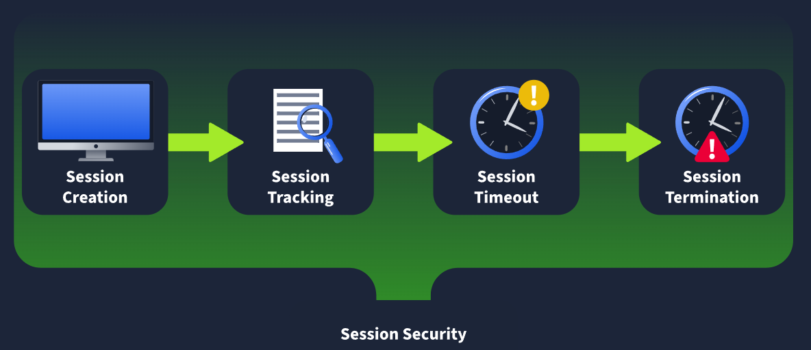
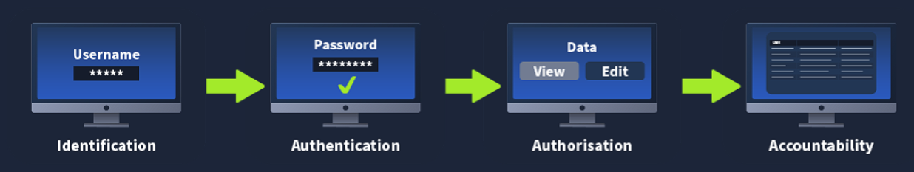

# **What is Session Management?**

**Session Management Lifecycle**

**Session Creation**

Alright, here's something that might surprise you when you're first learning about web sessions: the session often starts before you even log in.
Wait, what? Yeah, I thought the same thing at first!
Think about it this way - you land on a website like an online store. Even before you sign in, the site is already tracking things like what products you're browsing or what's in your cart. That's an unauthenticated session doing its thing.
But for our purposes in security testing, we care most about what happens after you log in - the authenticated session. Here's the flow:

1. You enter your username and password
2. The server says "Cool, you're legit" and generates a session value (think of it like a unique ticket)
3. Your browser sends this ticket with every request you make

Now here's the critical part from a security perspective: How is that session value created? How random is it? Where is it stored? These questions matter because weak session generation is like using "password123" - it's just asking for trouble.
Key Takeaway: Session creation isn't just about logging in. It's about HOW the application generates and manages your unique identifier. Bad session creation = potential session hijacking vulnerabilities.

**Session Tracking**

So you've got your session value (your special ticket). Now what?
Here's where it gets interesting. Remember how I mentioned HTTP is stateless? That means each request you make is like talking to someone with amnesia - the server doesn't naturally "remember" who you are from one request to the next.
The session value solves this problem. Here's how it works:

1. You make a request (like clicking "View Profile")
2. Your browser automatically includes your session value with that request
3. The server receives it and thinks: "Ah, session ABC123... let me look that up"
4. Server checks its records: "This belongs to user 'Alice' who has admin permissions"
5. Server responds accordingly

Here's where the security issues come in:
If the session tracking mechanism has flaws, an attacker might be able to:

* Steal your session value (session hijacking)
* Guess valid session values (if they're predictable)
* Inject their own session (session fixation)

When I'm pentesting, I'm always asking: "Can I intercept this session value? Can I predict it? Can I reuse it from somewhere else?"
Pro Tip: Use your browser's Developer Tools (F12) to actually SEE your session values being sent. Look in the Cookies tab or Network tab. Makes this concept way more real when you can watch it happen!

**Session Expiry**

Picture this scenario: You're checking your bank account at a coffee shop. You finish, close your laptop, and leave. But here's the problem - the HTTP protocol has no idea you left.
The server is just sitting there thinking "I guess they're still logged in?" This is dangerous, right? Someone could open your laptop and boom - still logged in.
This is why session expiry exists.
Think of your session value like milk in the fridge - it has an expiration date. Here's how it works:

* Your session gets created with a lifetime (maybe 30 minutes, maybe 2 hours)
* Every time you make a request, the server checks: "Is this session still fresh?"
* If the lifetime expired, the server says "Nope, this session is spoiled" and redirects you to login again

From a pentester perspective, I'm testing:

* How long do sessions last? (A 30-day session lifetime? That's sketchy!)
* Does the expiry actually work, or can I still use an "expired" session?
* Can I extend the lifetime by just staying active?

Real-world example: You know how your bank logs you out after 10 minutes of inactivity? That's aggressive session expiry for security. Meanwhile, Netflix might keep you logged in for weeks because the risk is lower.
Red Flag to Look For: Sessions that never expire or have absurdly long lifetimes (like weeks). That's a security issue waiting to happen.

**Session Termination**

Okay, session expiry is passive (time runs out naturally), but session termination is active - it's when YOU hit that logout button.
Here's what SHOULD happen when you click logout:

1. Browser sends logout request with your session value
2. Server receives it and immediately destroys that session
3. Even though the session lifetime hasn't expired yet, it's now dead
4. If someone tries to use that session value again, server says "Unknown session, who are you?"

Why does this matter for security?
Imagine you're at a library computer. You check your email, then click logout. If the session isn't properly terminated on the server-side, the next person who uses that computer might be able to hit "back" and boom - they're in your account.

When I'm pentesting, I'm checking:

* Does logout actually destroy the session server-side?
* Can I copy my session value BEFORE logging out, then use it AFTER?
* Is there a "Remember Me" feature that bypasses termination?

Classic vulnerability I've seen:

* User clicks logout
* Session appears dead on the client-side (cookie deleted from browser)
* BUT the server never invalidated it
* Attacker who intercepted that session value earlier can still use it

The Fix: True session termination means the server marks that session as invalid in its database/memory. Client-side deletion isn't enough!

Pro Tip: When testing web apps, try this: Log in, copy your session cookie value, log out, then manually re-add that cookie and refresh. If you're still logged in... you've found a vulnerability!

Which state in the session management lifecycle deals with user's pressing the logout button?

Session Termination

Which state in the session management lifecycle deals with user's providing their credentials?

Session Termination

Which state in the session management lifecycle deals with user's actions performed after authentication?

Session Tracking

Which state in the session management lifecycle deals with user's that forget to log out of the application?

Session Expiry

# **Authentication vs Authorisation**

**Identification**

Alright, let's start with the basics - identification is simply claiming who you are.
Think of it like walking up to a hotel front desk and saying "Hi, I'm checking in. My name is John Smith." You're not proving anything yet - you're just claiming an identity.
In web applications, this happens when you enter your username.
Here's what's going on:

* You type in "alice_wonder" or "alice@example.com"
* You're telling the application: "Hey, I'm claiming to be this person"
* The application notes: "Okay, someone is claiming to be alice_wonder"

Two common approaches:

1. Unique usernames - You pick "xXDarkHacker99Xx" during registration (we've all been there 😄)
2. Email as username - You use "alice@example.com" as your identifier

From a security testing perspective:

* Can I enumerate valid usernames? (Does the error message say "User doesn't exist" vs "Wrong password"?)
* Are usernames case-sensitive?
* Can I claim to be an admin user?

Important: Identification ≠ Authentication. You're claiming, not proving (yet).

**Authentication**

Now we get to the proof part! Authentication is proving you are who you claim to be.
Back to our hotel analogy - the front desk says "Okay, you claim to be John Smith. Can you show me your ID and confirmation number?"
In web apps, this is typically your password:
Here's the flow:

1. Identification: "I'm alice_wonder"
2. Authentication: "Here's my password: SecureP@ss123"
3. Server checks: "Does this password match what we have on file for alice_wonder?"
4. If valid: "Authentication successful! Creating your session now..."

This is the critical moment where session creation kicks in! Once the server confirms you are who you say you are, it generates that session value we talked about earlier.
Authentication methods I commonly see:

* Passwords (most common)
* Multi-Factor Authentication (MFA) - Password + code from your phone
* Biometrics - Fingerprint, face recognition
* Security keys - Physical USB devices
* OAuth - "Login with Google/Facebook"

As a pentester, I'm looking for:

* Weak password policies (can I use "password123"?)
* No rate limiting (can I try 1000 passwords per second?)
* Credential stuffing opportunities (leaked passwords from other breaches)
* Bypasses in the authentication logic

Key Distinction:

* Identification = "I am Alice" (claim)
* Authentication = "Here's proof I'm Alice" (verification)

**Authorisation**

Okay, so you've proven who you are. But that doesn't mean you can do everything. Authorisation is checking what you're allowed to do.
Real-world example: You've logged into your bank account (authenticated), but can you access someone else's account? Hopefully not! That's authorisation at work.
Here's how it works in practice:

1. You're logged in as "bob_user" (authenticated)
2. You try to access "/admin/delete-all-users"
3. Server checks your session: "Who is this? Oh, it's bob_user"
4. Server checks permissions: "Does bob_user have admin rights? Nope!"
5. Server responds: "403 Forbidden - You don't have permission"

This is where session tracking becomes crucial!
Remember that session value you got after authentication? Every request you make includes it, and the server uses it to:

* Figure out WHO you are (which user)
* Look up WHAT PERMISSIONS you have
* Decide IF you can do what you're asking

Common authorisation models:

* Role-Based (RBAC): You're a "user" or "admin" or "moderator"
* Attribute-Based: Checks specific attributes like "is_premium=true"
* Resource-Based: You can only edit your own posts, not others'

As a pentester, this is where I hunt for gold:

* Insecure Direct Object Reference (IDOR): Can I change /user/123/profile to /user/456/profile and access someone else's data?
* Privilege Escalation: Can I add &admin=true to my request and become admin?
* Missing Function-Level Access Control: Can I directly access /admin/panel even though I'm a regular user?

Pro Testing Tip: Log in as a low-privilege user, intercept requests in Burp Suite, and try accessing admin endpoints. You'd be surprised how often there's no authorisation check!
Remember: Just because you CAN authenticate doesn't mean you're AUTHORISED for everything!

**Accountability**

Alright, so someone just deleted the entire user database. Who did it? When? How? This is where accountability saves the day!
Accountability is creating an audit trail of who did what and when.
Think of it like security cameras in a store - if something goes wrong, you can review the footage to see what happened.
In web applications, this means logging:

* Who: Which user (tied to their session)
* What: What action they performed
* When: Timestamp
* Where: What endpoint/resource
* How: What method (GET, POST, DELETE, etc.)

Example log entry:
[2024-11-28 14:32:15] Session: abc123xyz | User: alice_wonder | Action: DELETE | Resource: /api/users/456 | IP: 192.168.1.100
Why this matters in session management:
Each request contains a session value, and that session is linked to a user. So when logging, we need to capture:

1. The session ID used
2. The user associated with that session
3. What they did with that session

From a security perspective:
When a breach happens, accountability logs help us answer:

* Was this the legitimate user or an attacker with a stolen session?
* What data did they access?
* When did the compromise start?
* What's the blast radius (how much damage)?

Real incident example I've seen:

* Logs showed session "xyz789" accessed 10,000 customer records in 2 minutes
* Normally this user accessed 5-10 records per day
* Investigation revealed stolen session cookie
* Logs helped identify WHEN the session was stolen and WHAT data was compromised

Red flags to look for when pentesting:

* No logging at all (yikes!)
* Logs that don't include session IDs
* Logs that aren't protected (can I delete or modify them?)
* Logs that don't capture sensitive actions

Pro Tip: Good accountability can actually DETER attackers. If they know everything is logged and tied to sessions, they're more cautious (or they'll target the logs themselves!).

What is the name of the process in the IAAA model that would be responsible for tracking your actions and logging them?</sumamry>
Accountability

What is the name of the process in the IAAA model that would be responsible for granting you a session value?

Authentication

What is the name of the process in the IAAA model that would be responsible for verifying that you have the relevant permissions to perform an action?

Authorisation

# **Cookies vs Tokens**

**Cookie-Based Session Management**

Alright, let's talk about cookie-based session management - often called the "old-school way" of handling sessions.
How it works:
When a web application wants to start tracking your session, it sends a response with a Set-Cookie header. Here's what that looks like:
Set-Cookie: session=12345;
What your browser does:
Your browser sees this header and automatically creates a cookie entry:

* Cookie name: session
* Cookie value: 12345
* Valid for: the domain where it came from

Cookie Attributes
The Set-Cookie header can include several attributes that control how the cookie behaves. Here are the important ones:

🔒 Secure
* The cookie is only transmitted over verified HTTPS channels
* If there are certificate errors or HTTP is used, the cookie won't be sent

🛡️ HTTPOnly
* The cookie value cannot be read by client-side JavaScript
* Adds a security layer against certain attacks

⏰ Expire
* Tells the browser when the cookie is no longer valid and should be removed
* Controls the cookie's lifetime

🔗 SameSite
* Controls whether the cookie can be transmitted in cross-site requests
* Helps protect against CSRF attacks

The Key Thing to Remember
The browser does the work automatically!
Here's what happens: The browser looks at the domain and the cookie's attributes, then decides on its own when to send the cookie with a request.
The cookie gets attached automatically - no client-side JavaScript code needed. The browser handles everything for you.

**Token-Based Session Management**

The big difference: Instead of relying on the browser's automatic cookie features, this method uses client-side code to handle everything.

How Token-Based Sessions Work

Step 1: After authentication
* The web application provides a token
* This token comes in the request body (not as a cookie header)

Step 2: Storage
* Client-side JavaScript code takes this token
* Stores it in the browser's LocalStorage

Step 3: Using the token
* When you make a new request, JavaScript code must:
* Load the token from storage
* Attach it as a header

JSON Web Tokens (JWT)
One of the most common token types is JSON Web Tokens (JWT).
JWTs are typically passed through the Authorization: Bearer header, like this:
Authorization: Bearer <your-token-here>

The "Wild West" Problem
Here's the thing about token-based sessions: since we're not using the browser's built-in cookie management, it's kind of like the wild west - anything goes.

What this means:
* There ARE standards out there
* But nothing is really forcing developers to stick to these standards
* Different applications might implement tokens in different ways

It's more flexible, but also less standardized than cookie-based approaches.

**Benefits and Drawbacks**

What cookie attribute can be used to ensure that the cookie is only transmitted via secure HTTPS channels?

Secure

What HTTP header is used in the response to inform the browser that a cookie is being sent?

Set-Cookie

What HTTP header is often used in requests to indicate the transmission of a JWT?

Authorization: Bearer

# **Securing the Session Lifecycle**

**Session Creation**

Session creation is where the most vulnerabilities can creep in. Let's dive into some common ones.

**Weak Session Values**

It is less common to see weak session values in modern times as frameworks are consistently used. However, with the rise of LLMs and other AI code-assistant solutions, you would be surprised at how often these old-school vulnerabilities are creeping back in.
If a custom session creation mechanism has been implemented, there is a good chance that the session values may be guessable. A good example of this is a mechanism that simply base64 encodes the username as the session value. If a threat actor can reverse engineer the session creation process, they can generate or guess session values to hijack the accounts of legitimate users.

**Controllable Session Values**

In certain tokens, such as JWTs, all the relevant information to both create and verify the JWT's validity is provided. If security measures are not enforced, such as verifying the token's signature or ensuring that the signature itself was created securely, a threat actor would be able to generate their own token. These types of attacks will be discussed in more detail in a future room.

**Session Fixation**

Remember the web application that already gave you a session before authentication? These web applications can be vulnerable to something called session fixation. If your session value is not adequately rotated once you authenticate, a suitably positioned threat actor could record it when you are still unauthenticated and wait for you to authenticate to gain access to your session.

**Insecure Session Transmission**

In modern environments, it is common for the authentication server and the application servers to be distinct. Think about things like Single Sign-On (SSO) solutions. One application is used for authentication to several other web applications. In order for this process to work, your session material must be transferred from the authentication server to the application server via your browser. In this transmission, however, certain issues can creep in that would expose your session information to a threat actor. The most common is an insecure redirect where the threat actor can control the URL where you will be redirected to post-authentication. This could allow the threat actor to hijack your session. This isn't just with custom implementations, Oracle's SSO solution had a massive bug that allowed for this to happen.

**Session Tracking**

Session tracking is the second largest culprit of vulnerabilities. Let's take a look.

**Authorisation Bypass**

Authorisation bypasses occur when there aren't sufficient checks being performed on whether a user is allowed to perform the action they requested. In essence, this fails to track the user's session and its associated rights correctly. It is also worth talking about the two types of authorisation bypasses:
* Vertical bypass - You can perform an action that is reserved for a more privileged user
* Horizontal bypass - You can perform an action you are allowed to perform, but on a dataset that you should not be allowed to perform the action on

In most applications, vertical bypasses are easy to defend against since function decorators and path-based access control configurations are used. However, with horizontal bypasses, the user is performing an action that they should be allowed to perform. The issue is that they are performing it on someone else's data. To remedy this, actual code is required to verify who the user is (extracted from their session), which data they are requesting, and if they are allowed to request or modify the dataset.

**Insufficient Logging**

A key issue during incidents is not having sufficient information to piece together an attack. While a lot of logging will occur at an infrastructure level, application logging can be crucial to understanding what went wrong. In the event that the actions performed by a specific session and the ability to retrace that session to a user do not exist, it can leave gaps in the investigation that cannot be filled. It is also worth making sure that logs cover both accepted and rejected actions. In the event of a session hijacking attack, the actions would appear legitimate. Therefore, simply logging rejected actions is not sufficient to paint the picture.

**Session Expiry**

Session expiry only has a single vulnerability, which is when the expiry time for sessions are excessive. A session should be seen as a ticket to a movie. Each night, the same movie is shown, but we don't want someone to be able to use the same ticket to watch the movie again. The same counts for sessions, we need to make sure that our session expiry time takes into consideration our specific application's use case. A banking application should have a shorter session lifetime than your webmail client.
Furthermore, in the event of long-life sessions, such as those for a webmail client, the session itself should attest to the location where it is used. If this location changes (which could be an indication of session hijacking), the session should be terminated.

**Session Termination**

For session termination, the key issue is when sessions are not properly terminated server-side when the logout action is performed. Suppose a threat actor were to hijack a user's session. In that case, even if the user became aware of the issue, without the ability to invalidate the session server-side, there isn't a method for the user to flush the access of the threat actor. However, this can be quite an issue for tokens where the lifetime of the token is embedded in the token itself. In these cases, the token can be added to a blocklist to be verified against. Some applications also take this further where all the sessions of the user can be viewed and terminated. Furthermore, upon a successful password reset, it is also recommended that all sessions are terminated to allow a user to regain full control of their account.

What phase of the session management lifecycle would be vulnerable if you could predict what the value of a session would be?

Session Creation

What phase of the session management lifecycle would be vulnerable if you don't have the ability to flush a threat actor's access to your session?

Session Termination

What phase of the session management lifecycle would be vulnerable if there wasn't sufficient information to piece together what happened during an incident?

Session Tracking

What phase of the session management lifecycle would be vulnerable if the session value itself was transmitted through an insecure redirect?

Session Creation

# **Exploiting Insecure Session Management**

**Mapping the Session Lifecycle**

To effectively exploit a vulnerable session management lifecycle, we first need to map out the lifecycle and capture detailed notes. Once we understand the intended lifecycle, we can start looking for weaknesses. We will be using the built-in browser tools for this demonstration. However, you can also follow along with more advanced web application testing tools, such as Burp. Let's navigate to our application at http://10.80.181.135 first.

**Login Panel**

We first notice that we are not presented with any cookies or tokens when we first visit the page. This tells us that unauthenticated sessions are most likely not being tracked. If we click the Sign-Up button, we see that there are two main signups:

Student - This can be used by anyone to create a profile
Lecturer - Requires a verification code for the signup process

This shows us that even without any brute-force techniques, we can kick off the session management lifecycle by creating a student account. Let's create a student account and see what happens.

**Registration and Authentication**

After creating the user account, we receive a prompt that the account has been created, and we are navigated back to the login page. Let's perform a login as our user and monitor the network traffic.
This tells us quite a bit of information:
* Cookies are being used for session management
* The HTTPOnly flag is set which means we would not be able to leverage JavaScript to read the cookie value
* The cookie expiry time seems weird since both the creation and expiry times for the cookie are the exact same
With this authentication, we also notice that we now have access to more functionality on the Dashboard.

**Session Tracking Investigation**

Using the menu navigation and reviewing the network traffic, we can see that session tracking is enforced through the cookie that is being transmitted with each request.
Note that your headers might differ slightly depending on which browser you use. However, an interesting thing to note is that even though the cookie expiry time has been reached, the same set cookie header is used to refresh the cookie to the exact same value. This might point to a persistent cookie. Let's see what happens when we remove this cookie. Under storage, remove the cookie and make the module request again.
The request seems to still succeed. However, if you take a closer look, you will see that we can now only see the modules but not the number of enrolled students or the potential tests.
This tells us that we might need to do further investigation to determine exactly what we are allowed to access from a completely unauthenticated perspective. This would warrant further investigation to fully map out the session management lifecycle. However, we will keep things slightly simpler. Let's take a look at the logout functionality.

**Session Termination Testing**

Once we press the logout button, we can see that our session is removed client-side.
However, we should probably test if the session is also terminated server-side. You can re-authenticate to the application and replace your new cookie with your old cookie value. But, it does seem like the session termination is working to some capacity as you get a 500 Internal Server Error when you refresh the page. This does tell us that there is something wrong here, since an invalid session should not lead to an internal server error. Let's investigate.

**Local Storage Discovery**

Let's revisit some of our previous claims here. If we navigate to the Local Storage, we do notice quite a bit of data is being stored.
Let's play around by updating our userRole from student to lecturer and refreshing the page.
While we now have access to more tabs, it seems like we don't have access to more information since we can't see any students or test attempts. Let's take this further by updating our role in the user value from a 2 to a 3. Sadly, this still gives us the same results. However, there are more values to play with here, such as our id and username. We will have to come back to this. However, this new information tells us that the sessions might be managed not purely through a cookie but through token information.

**Session Lifecycle Summary**

Now, we have mapped out the session management lifecycle. Let's take a look:
Lifecycle Phase: Session Creation
* A combination of cookie- and token-based session management is being used
* A new session value is provided for each login attempt
* The session value itself appears to be sufficiently random

Lifecycle Phase: Session Tracking
* Unauthenticated actions are not tracked via a session
* The cookie is sent in each request for tracking
* Several requests can be made without a cookie
* The initial token values that are loaded post-authentication dictate the visible information

Lifecycle Phase: Session Expiry
* There is a mismatch between the client-side and server-side expiry times
* The expiry time is incredibly long

Lifecycle Phase: Session Termination
* Users can forcibly terminate their session
* Sessions are terminated server-side but reusing an old session leads to an internal server error

Given all of this information, we would already report the following vulnerabilities on a security assessment:
* Excessive Session Lifetimes

We would also need to investigate the following further:
* Access controls on all API endpoints
* Web application logs for the accountability of actions

**Exploitation**

Given all of the information provided above, it seems like we need to do a little bit more exploring to see if we can access sensitive data. Using the information you learned about securing the session management lifecycle and the information of the mapped-out lifecycle, see if you can get access as a student to lecturer information.

What is the username of the student with the name X?

THM{Got.the.User}

How many lecturers are registered on the application?

1

Excluding the unauthenticated user, how many roles does the application have?

3

How many test attempts in total have been performed on the application?

4

What is the highest score that student1 has achieved on a test?

3

What is the sequence of correct answers for the Database Types test? (Format y=yes and n=no, separated by commas)

y,n,n

# **Conclusion**

**Defences**

To defend against these attacks, it is important to implement a secure session management lifecycle. While several items were touched on in this room, let's take a look at a recap:
* The session's values must be stored securely, regardless of being a cookie or a token
* The session values themselves must be either sufficiently random and non-guessable or use a signing mechanism to ensure that they cannot be tampered with
* Sessions should be used to track user actions and perform authorisation checks to ensure the user can perform the requested action
* Sessions should expire after a set amount of time to prevent them from being used for persistent access
* If the logout button is pressed, the session should be removed client-side and invalidated server-side. Otherwise, a user would be unable to destroy their session if it was compromised
