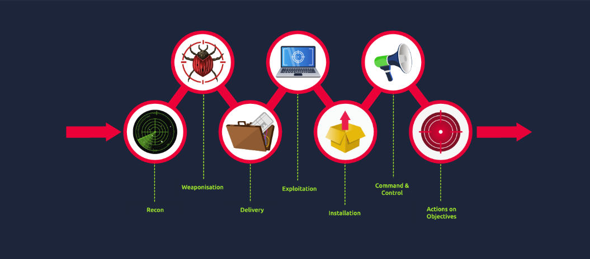
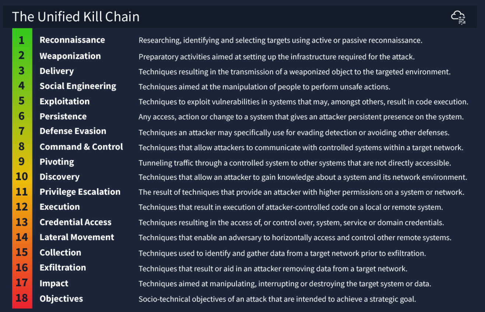
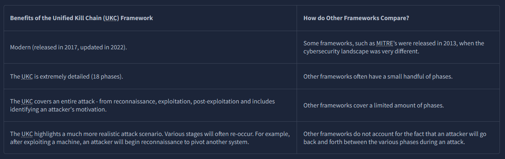
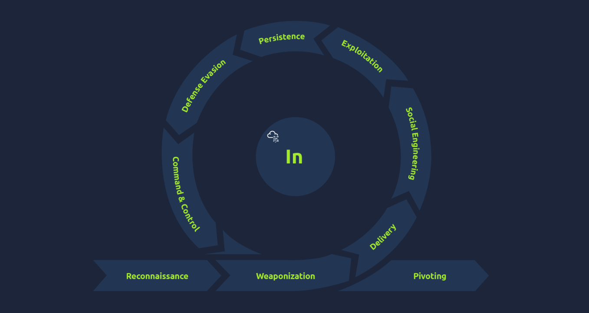
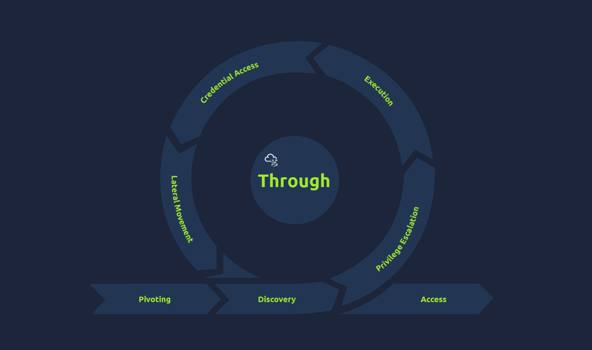
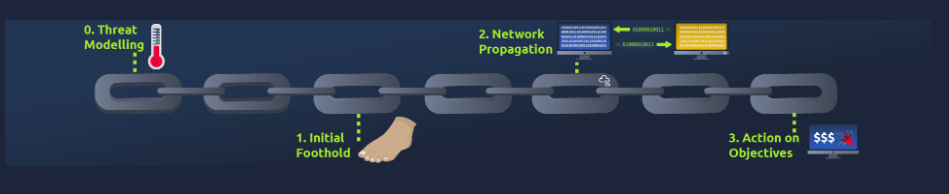

Understanding how cyber threats work—their goals, methods, and behaviour—is key to building strong defences (your cybersecurity posture).

In this room, you’ll be introduced to the Unified Kill Chain (UKC), a framework that explains how cyber attacks unfold.

Learning goals:

* See why frameworks like the UKC are useful for improving cybersecurity
* Use the UKC to understand attackers’ motives, tactics, and methods
* Learn the main phases of the UKC
* Understand how the UKC works alongside other frameworks, like MITRE

# **What is "Kill Chain"**

The term “Kill Chain” comes from the military and describes the steps of an attack. In cybersecurity, it refers to the path attackers—like hackers or APTs—take to break into a system.

For example: scanning a target, exploiting a web flaw, then escalating privileges. Each step is part of a Kill Chain.

By understanding these stages, defenders can spot attacks early, block them, or disrupt the attacker’s progress.

Where does the term "Kill Chain" originate from?

For this answer, you must fill in the blank!: The ********

 military 
 

# **What is "Threat Modelling"**

Threat modelling in cybersecurity is a process used to make systems more secure by finding and reducing risks. In simple terms, it means:

* Identify the systems and applications that need protection, and what role they play (e.g., storing payment info or running daily operations).
* Assess their weaknesses and how attackers could exploit them.
* Plan how to secure them against those risks.
* Prevent future issues with policies, such as using secure development practices (SDLC) or staff training against phishing.

Threat modelling gives a clear, high-level view of an organisation’s IT assets (hardware and software) and how to protect them.

The Unified Kill Chain (UKC) supports threat modelling by showing where attacks might happen and how systems could be exploited.

There are also frameworks built specifically for threat modelling, such as STRIDE, DREAD, and CVSS. If you’d like to go deeper, check out the [Principles of Security](https://tryhackme.com/room/principlesofsecurity) room on TryHackMe.

What is the technical term for a piece of software or hardware in IT (Information Technology?)

asset

# **Introducing the Unified Kill Chain**

Paul Pols introduced the Unified Kill Chain (UKC) in 2017 to complement, not replace, other frameworks like Lockheed Martin’s Kill Chain and MITRE ATT&CK.

The UKC breaks an attack into 18 phases—from reconnaissance to data theft and attacker motives. For simplicity, this room groups them into broader focus areas, which we’ll cover in the next tasks.

The UKC’s main advantage: it’s modern and highly detailed. Unlike older frameworks with only a few stages, the UKC gives a much fuller picture of how attacks unfold.

In what year was the Unified Kill Chain framework released?

2017

According to the Unified Kill Chain, how many phases are there to an attack?

18

What is the name of the attack phase where an attacker employs techniques to evade detection?

Defense Evasion

What is the name of the attack phase where an attacker employs techniques to remove data from a network?

Exfiltration

What is the name of the attack phase where an attacker achieves their objectives?

Objectives

# Phase: In (Initial Foothold)

Main Idea

This group of UKC phases covers how an attacker gains and maintains access to a system. Attackers often mix these tactics to move deeper into a target.

Phases

1. Reconnaissance ([MITRE TA0043](https://attack.mitre.org/tactics/TA0043/))
Attackers gather information about the target.
Examples:
* Discovering systems, apps, and services
* Collecting employee names for phishing
* Searching for leaked credentials
* Mapping network topology

1. Weaponization ([MITRE TA0001](https://attack.mitre.org/tactics/TA0001/))
Setting up the tools and infrastructure needed for the attack.
Examples:
* Preparing command & control (C2) servers
* Building payloads (e.g., reverse shells)

1. Social Engineering [(MITRE TA0001](https://attack.mitre.org/tactics/TA0001/))
Manipulating people to assist the attack.
Examples:
* Sending malicious attachments
* Fake login pages to steal credentials
* Impersonating staff or service providers

1. Exploitation ([MITRE TA0002](https://attack.mitre.org/tactics/TA0002/))
Taking advantage of system flaws to run malicious code.
Examples:
* Uploading and executing a reverse shell
* Abusing vulnerable scripts
* Exploiting web app bugs

1. Persistence ([MITRE TA0003](https://attack.mitre.org/tactics/TA0003/))
Keeping long-term access to the system.
Examples:
* Installing malicious services
* Linking system to a C2 server
* Planting hidden backdoors

1. Defence Evasion ([MITRE TA0005](https://attack.mitre.org/tactics/TA0005/))
Avoiding detection and bypassing security measures.
Examples:
* Evading firewalls, WAFs, IDS, or antivirus
* Masking malicious activity to stay undetected

1. Command & Control ([MITRE TA0011](https://attack.mitre.org/tactics/TA0011/))
Connecting back to the attacker’s infrastructure to issue commands.
Examples:
* Remote command execution
* Stealing data and credentials
* Using the system as a stepping stone

1. Pivoting ([MITRE TA0008](https://attack.mitre.org/tactics/TA0008/))
Moving from one compromised system to others inside the network.
Examples:
* Using a hacked public server to access internal systems
* Targeting less protected machines that hold valuable data

What is an example of a tactic to gain a foothold using emails?

Phishing

Impersonating an employee to request a password reset is a form of what?

Social Engineering

An adversary setting up the Command & Control server infrastructure is what phase of the Unified Kill Chain?

Weaponization

Exploiting a vulnerability present on a system is what phase of the Unified Kill Chain?

Exploitation

Moving from one system to another is an example of?

Pivoting

Leaving behind a malicious service that allows the adversary to log back into the target is what?

Persistence

# **Phase: Through (Network Propagation)**

After establishing a foothold on the target network, the attacker seeks to gain higher access and privileges. They use a compromised system as a pivot point to explore the internal network and gather information to achieve their objectives.

Pivoting ([TA0008](https://attack.mitre.org/tactics/TA0008/))
After gaining access, attackers use the compromised system as a staging point to connect their operations to the victim’s network and distribute malware or backdoors.

Discovery ([TA0007](https://attack.mitre.org/tactics/TA0007/))
Attackers gather information about the system and network, including user accounts, permissions, installed software, browser activity, files, directories, shares, and configurations.

Privilege Escalation ([TA0004](https://attack.mitre.org/tactics/TA0004/))
Using discovered vulnerabilities or misconfigurations, attackers elevate their access to higher privileges, such as SYSTEM/ROOT, local admin, or accounts with special access.

Execution ([TA0002](https://attack.mitre.org/tactics/TA0002/))
Malicious code is deployed on the pivot system—remote trojans, scripts, malicious links, or scheduled tasks—to maintain persistence.

Credential Access ([TA0006](https://attack.mitre.org/tactics/TA0006/))
Attackers steal usernames and passwords through methods like keylogging or credential dumping, allowing them to operate undetected using legitimate credentials.

Lateral Movement ([TA0008](https://attack.mitre.org/tactics/TA0008/))
With elevated privileges, attackers move across the network to access other target systems, often using stealthy methods.

As a SOC analyst, you pick up numerous alerts pointing to failed login attempts from an administrator account. What stage of the kill chain would an attacker be seeking to achieve?

Privilege Escalation

Mimikatz, a known post-exploitation tool, was recently detected running on the IT Manager’s computer. Security logs show that Mimikatz attempted to access memory spaces typically used by Windows to store user authentication secrets. Considering the usual capabilities and purpose of Mimikatz, what is the primary objective of this tool in such an attack scenario?

Credential dumping

# **Phase: Out (Action on Objectives)**

This phase marks the culmination of an adversary’s attack, where they have access to critical assets and can achieve their objectives, typically targeting the confidentiality, integrity, and availability (CIA) of the environment.

Tactics include:

Collection ([TA0009](https://attack.mitre.org/tactics/TA0009/))
The attacker gathers valuable data from drives, browsers, emails, and media, compromising confidentiality and preparing for exfiltration.

Exfiltration ([TA0010](https://attack.mitre.org/tactics/TA0010/))
Data is stolen using encryption and compression to avoid detection, often leveraging the previously established C2 channels.

Impact ([TA0040](https://attack.mitre.org/tactics/TA0040/))
To disrupt operations or damage assets, the attacker may manipulate, delete, or encrypt data (e.g., ransomware, DoS attacks, defacement), targeting integrity and availability.

Objectives
With full access, the attacker achieves their strategic goal—financial gain through ransomware, or reputational damage by leaking confidential information.

While monitoring the network as a SOC analyst, you realise that there is a spike in the network activity, and all the traffic is outbound to an unknown IP address. What stage could describe this activity?

Exfiltration

Personally identifiable information (PII) has been released to the public by an adversary, and your organisation is facing scrutiny for the breach. What part of the CIA triad would be affected by this action?

Confidentiality

# **Practical**

Deploy the static site attached to the task. You will need to match the various actions of an attacker to the correct phase of the Unified Kill Chain framework to reveal the flag.

Match the scenario prompt to the correct phase of the Unified Kill Chain to reveal the flag at the end. What is the flag?

THM{UKC_SCENARIO}

# **Conclusion**

Congrats on making it through the Unified Kill Chain room. Hopefully, you understand the importance that frameworks such as the UKC play in identifying risk and potential mitigating attacks by reconstructing the various steps an attacker took.

As mentioned in this room, the UKC is a modern extension of other frameworks, such as Lockheed Martin's "Cyber Kill Chain" framework. If you are interested in learning more about frameworks in cybersecurity (highly recommended!), you should check out these rooms on TryHackMe:

[Principles of Security](https://tryhackme.com/room/principlesofsecurity)
[Pentesting Fundamentals](https://tryhackme.com/room/pentestingfundamentals)
[Cyber Kill Chain](https://tryhackme.com/room/cyberkillchainzmt)

