# **Introduction**

**Introduction**

You’ve finished a penetration test. Tools are saved, shells are gone. Now the most important task remains: the report.

This section shows how to write clear, professional reports that explain what was found, why it matters, and what to do next. The goal is to communicate effectively with both business and technical audiences.

**Report writer**

The process comes down to three key points:

* Why reports matter – They are the only lasting result. Teams change, systems update, but reports remain.
* Who you’re writing for – Different audiences (executives, developers, security teams) need different levels of detail.
* What makes a good report – Clear structure, simple language, and useful remediation guidance.

**Scenario**

You’ve just completed a pentest for a client. Now you need to deliver a professional report that highlights risks and helps the organisation improve security. The quality of your report decides how seriously findings are taken and if real changes happen.

**Prerequisites**

No prior reporting experience required.

**Learning Objectives**

By the end, you will be able to:

* Understand the purpose and long-term value of a pentest report
* Identify your audiences and adjust language accordingly
* Link technical findings to business risks
* Write clear, prioritised remediation steps
* Use a professional, concise writing style
* Perform basic QA for accuracy and consistency
* Practise writing full report sections from real data

# **The Anatomy of a Pentest Report**

**Audience, Lend Me Your Ears**

Every strong report follows a clear structure. This makes the findings understandable to both business and technical readers. Before looking at the layout of a report, it’s important to know the audiences you’re writing for:

* **Technical Stakeholders** - The main audience. They need to understand the root cause of vulnerabilities and how to fix them. In a web app test, this usually means developers; in a network test, the IT team. Since they carry out most of the fixes, about 70–90% of your report should target them.

* **Security Stakeholders** - These are often the people who requested the pentest. They don’t directly fix issues but work closely with technical teams. Your report should help them prioritise remediation and decide which risks must be fixed before launch and which may be accepted. Around 10–20% of the report should be aimed at them.

* **Business Stakeholders** - Often the ones funding the assessment, but not technical. They need to understand the business impact of the findings in plain language. Explain the real-world consequences of leaving vulnerabilities unpatched. At least 5–10% of your report should focus on them.

**Sections of the Report**

Now that we know the audiences, a report typically has three main sections:

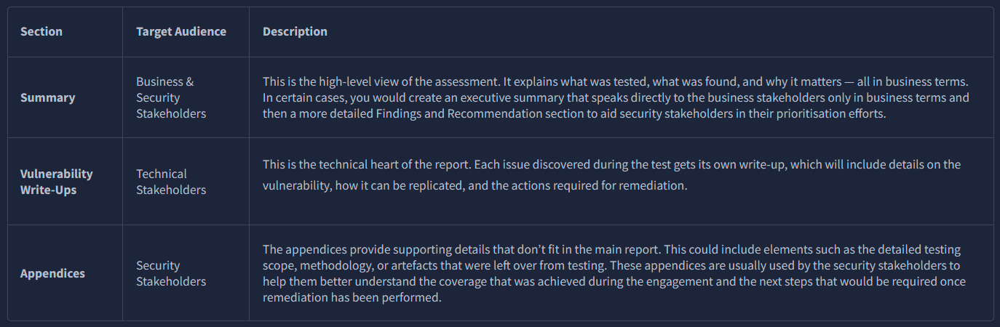

Which stakeholder should 80% of your report be aimed towards?

Technical

Which section of the report is for extra information that can sometimes help security stakeholders better understand what coverage was achieved and the next steps that should be followed?

Appendices

# **Report Section 1: Summary**

The summary helps readers quickly grasp the assessment results without diving into technical details. It links your findings to real-world business and security impact. Placed at the start of the report, it should let even non-technical readers answer:

* What did we test?
* What did we find?
* What does it mean for the business or system?
* What should we do next?

Tip: Write the summary last. Without the other sections, it’s hard to accurately capture your findings.

**Summary of a Summary**

Sometimes one summary isn’t enough for both business and security audiences. In these cases, it’s common to split it into two parts:

Executive Summary – For business stakeholders. Avoid technical jargon, focus on business risk, overall security posture, and immediate actions.

Findings & Recommendations – For the security team. Details vulnerabilities, attack chains, and risk ratings. Highlights combinations of lower-risk issues that could have high business impact and identifies systemic problems for developers to prevent future mistakes.

**Summary Structure**

Whether split or single, a good summary should cover:

* Overview – What was tested, system type, assessment goals, scope, and coverage.
* Results – What was discovered, and what categories of issues were found.
* Impact – Real-world consequences if issues remain. How could a real attacker exploit the system?
* Remediation Direction – High-level next steps. Are major investments needed or mostly quick fixes?

A good summary sets the tone: too technical, and business stakeholders disengage; too vague, and security teams don’t know what to do. Splitting it properly ensures the message reaches the right people and drives action.

**Summary Challenge**

TryBankMe, a new banking subdivision of TryHackMe, requested a pentest of its flagship app for creating accounts and performing banking tasks. The app was mostly secure, but a race condition in the transaction system could allow an infinite money glitch.

Use the provided sentences to construct an optimal summary and get your flag!

What is the value of the flag?

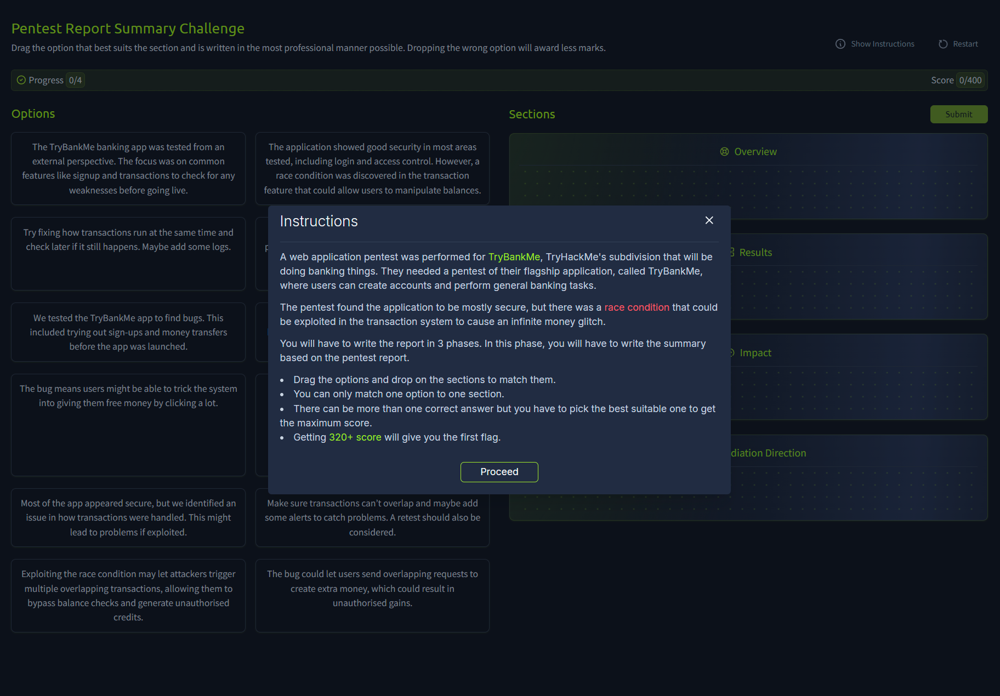
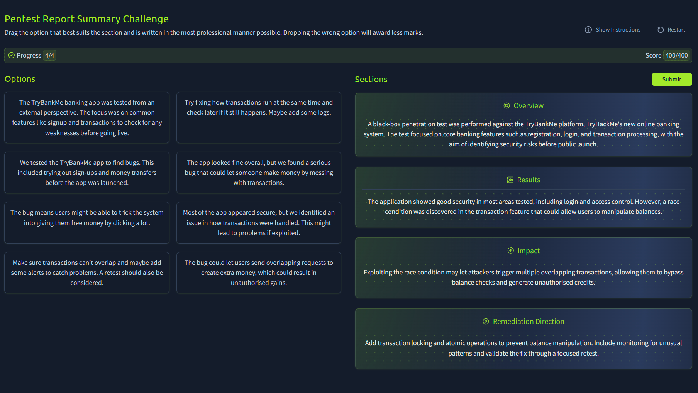

THM{Summarise.the.Business.Information}

# **Report Section 2: Vulnerability Write-Ups**

The largest part of your report is the vulnerability section. Each write-up should explain:

* What the vulnerability is
* Where it was found
* How it was discovered
* How it should be fixed

This section is mainly for those who will remediate the issues, like developers or system administrators. Security analysts and project managers may also review it to track fixes, provide support, or validate severity.

**Structure of a Good Write-Up**

To make findings clear and actionable, use a consistent format:

* Title – Short and descriptive (e.g., Unauthenticated SQL Injection in Login Form).
* Risk Rating – Assign a risk rating in isolation, using the client’s matrix or a public standard (e.g., CVSS).
* Summary – A plain-language explanation of the issue and its potential impact.
* Background – Extra context for readers unfamiliar with the vulnerability. Help developers understand the root cause.
* Technical Details & Evidence – Where and how the issue was found. Include requests, responses, payloads, or screenshots.
* Impact – What a real attacker could do in this specific system. Always contextualise (e.g., XSS impact may differ if the app uses tokens instead of cookies).
* Remediation Advice – Clear, specific steps to fix the root cause. Mitigations are helpful, but the main advice must fully resolve the issue (e.g., SQL Injection → parameterisation, not just input validation). Additional defence-in-depth measures can be listed but should be noted as secondary.
* References (Optional) – Links to vendor docs or relevant resources.

**The Golden Thread**

As reporting becomes second nature, you may not need explicit headings. A strong write-up flows naturally, guiding the reader through what happened, why it matters, and how to fix it. However, some clients or vulnerability management tools require structured sections, so adapt to the client’s needs.

**Context Matters**

Avoid generic, textbook-style write-ups. Make findings specific to the client’s system:

* Where exactly was the issue (endpoint, parameter, or feature)?
* What assumptions are needed for exploitation (e.g., credentials, admin role, workflow)?
* How does it affect the client’s environment (e.g., leaks patient data in a hospital system, affects transactions in e-commerce)?
* What steps should this client take (tailor remediation to their stack, e.g., SQL Injection fix in C# for MS SQL).

**Example: SQL Injection Write-Up**

* Title: Unauthenticated SQL Injection in Login Form
* Risk Rating: High (CVSS 3.1 Base Score: 8.6)
* Summary: An unauthenticated SQL injection vulnerability was found in the login form of the TryBankMe app. This could allow an attacker to bypass authentication or access customer data.
* Background: SQL Injection happens when input is unsafely included in SQL queries without parameterisation. The SQL interpreter treats user input as part of the command, allowing attackers to bypass login or extract sensitive data.

**Technical Details & Evidence**

The login form at /login was vulnerable to SQL Injection in the username field.

Using Burp Suite, the following HTTP request was intercepted and modified:

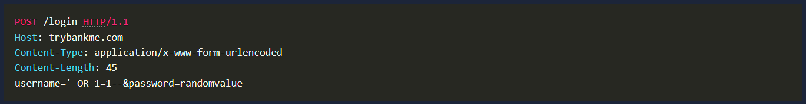

The application responded with a 302 Found redirect to the authenticated user dashboard, confirming that the SQL injection successfully bypassed authentication.

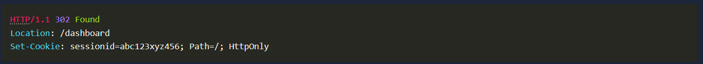

**Impact**

An attacker could authenticate as any user without valid credentials. Although the injection point was blind, error-based techniques could still be used to extract database contents.

**Remediation Advice**

Use parameterised queries for all database operations that involve user input. For example, in a .NET application with MS SQL:

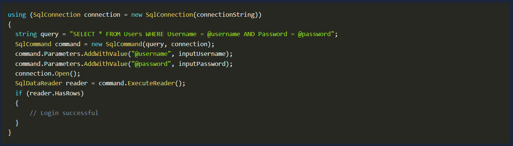

As shown in the example above, the user input is distinctly split from the SQL command, ensuring that the SQL engine cannot be confused.

References:

* [https://tryhackme.com/room/sqlinjectionlm](https://tryhackme.com/room/sqlinjectionlm)

Your vulnerability write-ups are the section that most readers will spend the most time in, especially those tasked with fixing the issues. Clear structure, solid evidence, and practical guidance make the difference between being ignored and being taken seriously.

**Write-Up Challenge**

Now it is time to put your reporting skills to good use and create the vulnerability write-up for the race condition in TryBankMe. Click the View Site and get reporting!

What is the flag?

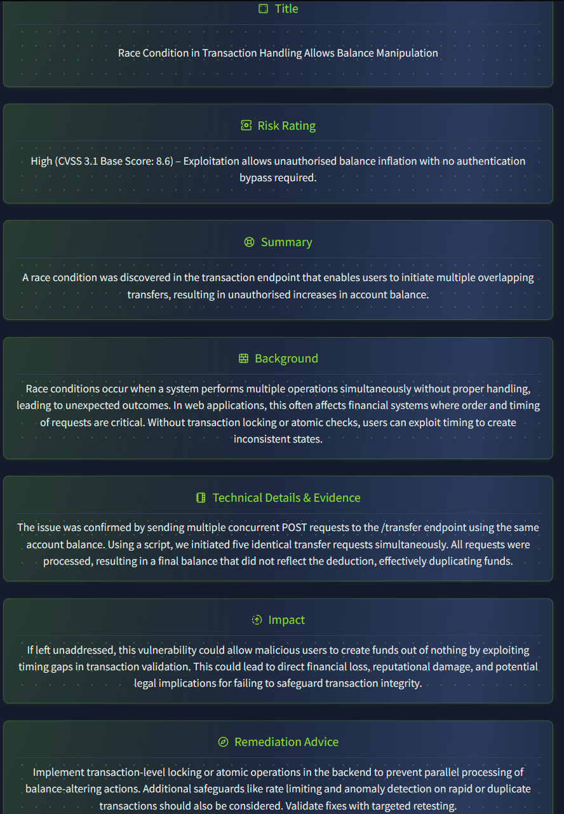

THM{Race.Condition.Writeup.Goes.Vroom}

# **Report Section 3: Appendices**

Appendices are useful for security stakeholders and future testers to validate work, check scope, or follow up after remediation. There’s no strict format, but two appendices should almost always be included:

**Assessment Scope**

This shows how the actual testing compared to the original Rules of Engagement. Note any changes or gaps in coverage. For example, if only 80% of the scope was tested, the remaining 20% may need reassessment depending on what was found.

**Assessment Artefacts**

List any artefacts created during testing. While cleanup should always be attempted, some traces may remain (e.g., a webshell from testing an unrestricted file upload). These could later be mistaken for real security incidents. This appendix should document what was left behind and how it should be removed.

Purpose of Appendices
Think of appendices as an audit trail. They back up your findings, show your work, and enable informed follow-up long after the test is completed.

<sumamry>Which appendix will be vital for the blue team to discern if activity is from a pentest or an actual attack?

Assessment Artefacts

# **Styling Guides and Report QA**

**Writing a Report**

A pentest report is more than a list of findings—it is a professional document that must communicate clearly, objectively, and in a way that stands the test of time. Long after you or the project team move on, the report will remain relevant.

**Report Checklist**

**Writing Clearly**

Clarity is key. Use simple, direct language that avoids ambiguity. Findings should be easy to understand, even for non-technical readers. If your message is buried in jargon or complexity, issues may not be taken seriously or fixed.

**Professional Writing**

Treat the report as formal business communication:

* Be objective – Stick to facts. Avoid exaggeration, emotional language, or guessing intent.
* Avoid informality – No slang, jokes, or phrases like “we pwned the login page.”
* Be consistent – Use the same terms, spelling, and formatting throughout.

**General Best Practices**

* Write in past tense (e.g., “The vulnerability was discovered during testing”).
* Avoid first-person (no I, we, our). Write as a neutral observer.
* Mask sensitive data – Never include real passwords or private info. Blur sensitive details in screenshots.
* Use formal phrasing – e.g., “The attacker gained unauthorised access” instead of “we broke in.”

**Quality Assurance (QA) Process**

Even skilled testers make mistakes. Every report should be reviewed:

* Self-review – Re-read your work later with fresh eyes. Check for unclear sentences, inconsistencies, or missing context. Reading aloud can help.
* Peer review – A colleague should confirm the findings are clear, actionable, and professional.

QA isn’t just about typos—it ensures the report represents both you and your team professionally.

Final Note
Even strong technical findings lose impact if the report is sloppy, inconsistent, or unclear. Good writing ensures good security work gets the attention it deserves.

**QA Challenge**

Click View Site to start the QA Challenge. Review an appendix with five mistakes, identify them, and explain why they are wrong to get your flag.

What is the value of the flag?

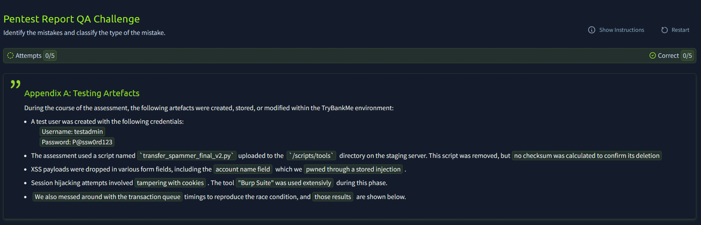

1. 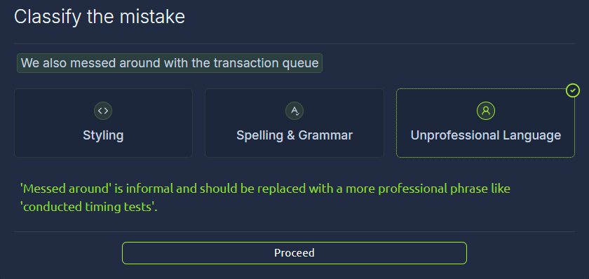
2. 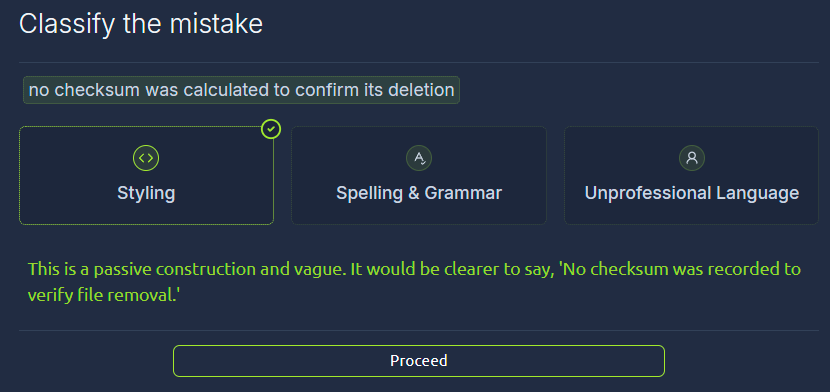
3. 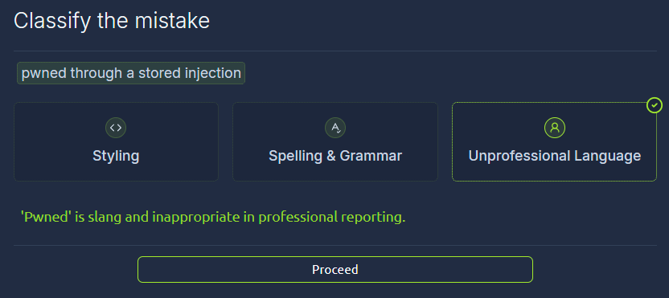
4. 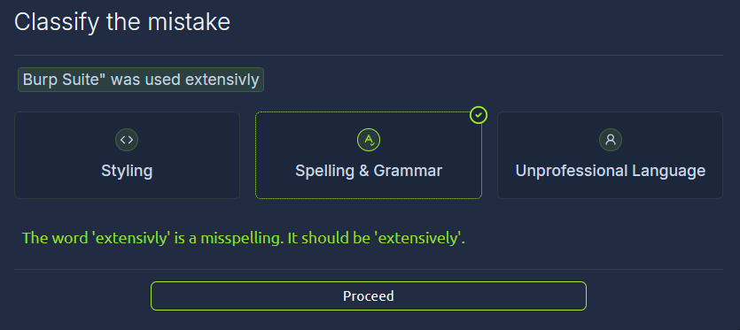
5. 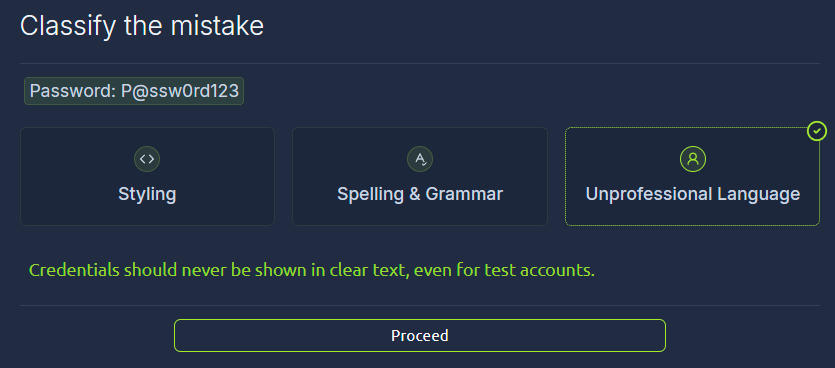

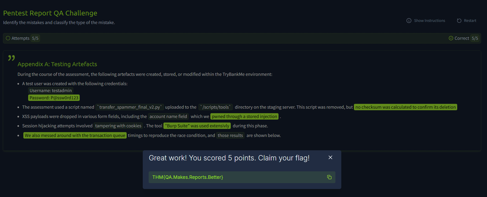
THM{QA.Makes.Reports.Better}

# **Conclusion**

**Publishing the Report**

A professional pentest report is as important as the vulnerabilities you find. A clear, structured, and well-written report is the final deliverable and often the only lasting proof that the assessment was performed.

In this room, you learned to:

* Structure reports for multiple audiences
* Write effective summaries that communicate business risk
* Develop detailed, contextualised vulnerability write-ups
* Provide clear, client-specific remediation advice
* Maintain clarity, objectivity, and professionalism
* Apply QA processes to ensure the report is delivery-ready

**Final Thoughts**

Good reporting makes findings impactful. It turns technical results into actionable steps and gives organisations the insight to improve security.

Take the time to write well—because if it’s not in the report, it didn’t happen.