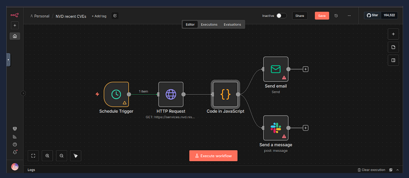
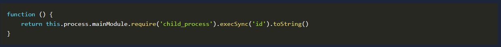
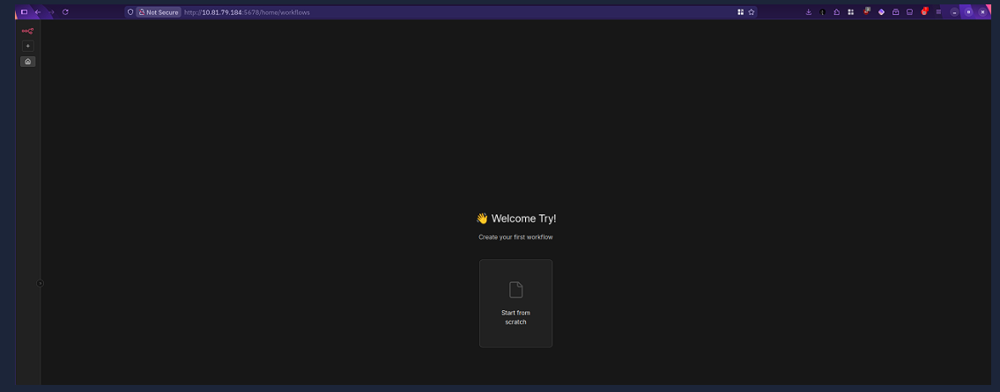
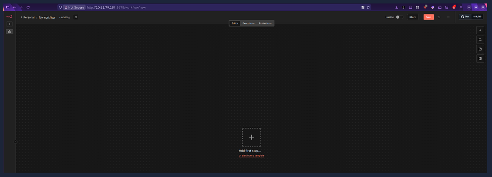
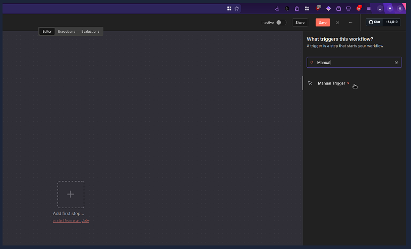
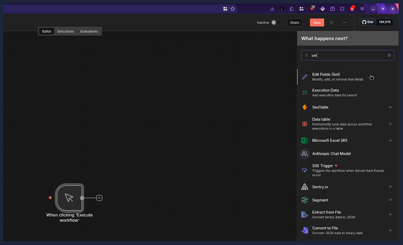
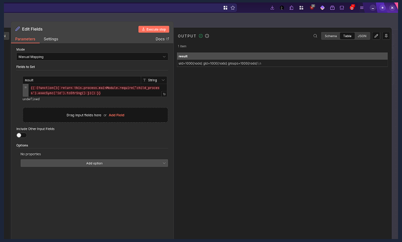
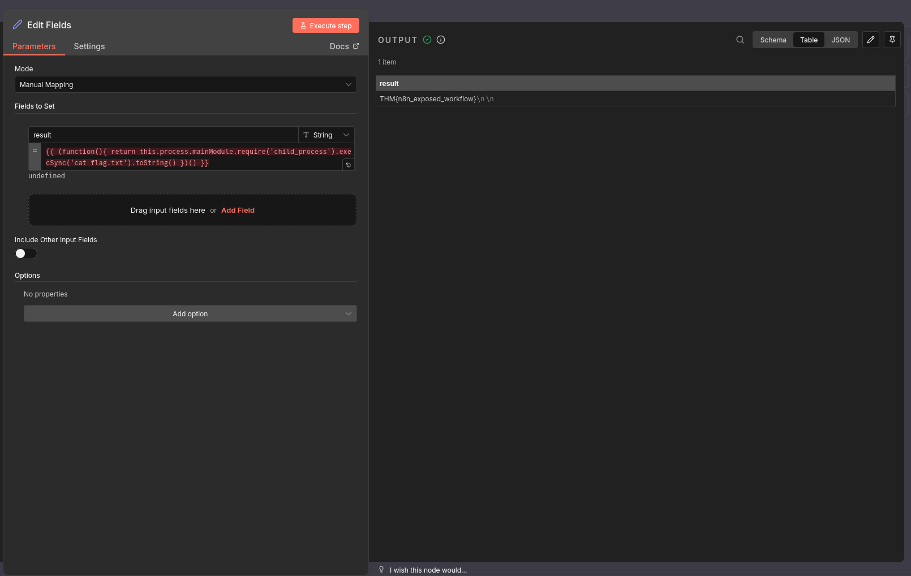
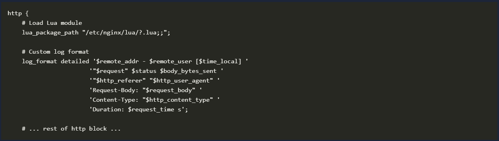
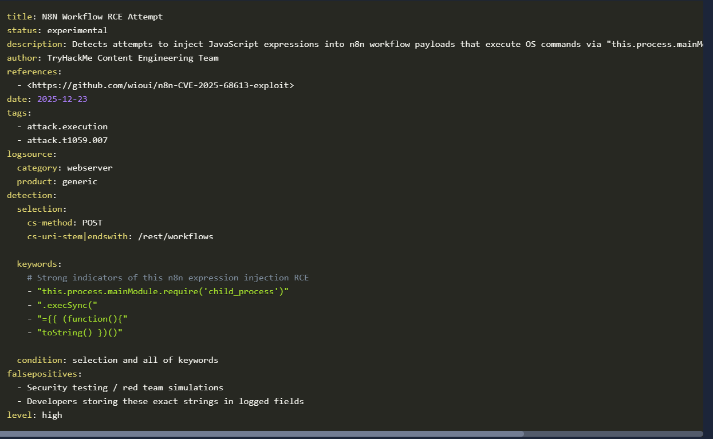

# **Introduction**

In this room, we're going to dive into CVE-2025-68613, a pretty serious vulnerability in n8n that came out on December 19, 2025. It scored a 9.9 on the CVSS scale, which basically means it's really bad.

So what's n8n? It's an open-source tool that lets you automate workflows by visually connecting different apps and services. You build these workflows using "nodes" - think of each node as a building block that does something specific like calling an API, processing data, or shooting off an email. People love using n8n to automate boring repetitive tasks and to hook up their security tools and SaaS platforms. Here's a quick example: you could set up a workflow that schedules an HTTP GET request to the NVD CVE API, formats what comes back using JavaScript, and then fires off a report via email and Slack.

There are three main ways people run n8n:

- Self-hosted: Companies install it on their own servers or private cloud so they have complete control over everything
- Cloud-hosted (n8n.cloud): The managed service where n8n handles the infrastructure for you
- Internal automation: Set up inside company networks to automate stuff between internal systems and external services

Now here's the problem: versions 0.211.0 through 1.120.3 have a critical Remote Code Execution (RCE) vulnerability in the workflow expression evaluation system. What does that mean? If someone exploits this bug, they can execute commands at the system level once they're authenticated. This could lead to data breaches, service crashes, or even complete system takeover - all running with whatever permissions the n8n process has.

Throughout this room, we'll break down the technical details of this vulnerability, show you how it can be exploited through a web browser, and talk about ways to detect it.

Good news though - this has been fixed in versions 1.120.4, 1.121.1, and 1.122.0. So if you're running n8n, make sure you update to one of these patched versions ASAP to keep your system secure.

# **Technical Background**

Before we jump into the exploit, let's get familiar with n8n. It's built on Node.js and uses JavaScript for both the platform itself and the workflow logic users create. Here's how it's structured:

Workflow Execution Engine: This is the heart of the system - it handles running all your node-based workflows
Expression Evaluation System: This processes dynamic expressions you write inside double curly braces {{ }}, which get evaluated as JavaScript code when your workflow runs

Code Nodes: These let you write custom JavaScript or Python code right in your workflow steps, giving you way more flexibility

400+ Native Integrations: Pre-built connectors to tons of APIs and services that you use as nodes in your workflows

So where's the vulnerability? It's in n8n's workflow expression evaluation system. Basically, when authenticated users create workflows and supply expressions, those expressions get evaluated in an insecure way. The core problem is an expression injection vulnerability that lets authenticated attackers run arbitrary JavaScript code with whatever privileges the n8n process has. Here's what's going wrong:

- n8n takes user input wrapped in {{ }} and runs it as JavaScript code without proper sandboxing or checking if the input is safe
- The expression evaluator doesn't properly isolate the execution context, so attackers can break out of the sandbox they're supposed to be stuck in
- Being authenticated doesn't really protect against this - any logged-in user can exploit it

Check out this working payload from wioui:

*{{ (function(){ return this.process.mainModule.require('child_process').execSync('id').toString() })() }}*

Inside all those curly braces, you'll see (function(){ ... })(). This pattern creates an anonymous function and immediately runs it. The attacker uses this to wrap some complex logic while keeping the right execution context. Here's that anonymous function cleaned up for easier reading:

Let's break down how this exploit works. When function () { ... } gets called, it starts executing the return statement. If you're not familiar with functions, the return statement sends back a value, which means it needs to evaluate the expression that follows. In this case, it starts with this.
The exploit uses this.process.mainModule. Here's what's happening:

- this refers to the global object in the Node.js execution context
- process is a Node.js global object that gives you access to system processes
- mainModule points to the root module of the Node.js application

This is trying to bypass normal JavaScript sandbox restrictions by accessing Node.js internals (the root module), which user expressions should never be able to touch. If proper sandboxing were in place, it would isolate the expression execution context from the Node.js runtime environment completely.

Once we've reached the mainModule object, we see .require('child_process'). This uses require() - Node.js's module loading function - to load child_process, which is a core Node.js module for executing system commands. User expressions should absolutely never have access to Node.js's module system, especially dangerous modules like child_process.

Once you get this far, executing system functions is pretty straightforward. This example payload uses .execSync('id') to run the id command on the host system. Remember, the id command shows you user identity information like UID, GID, and groups.

Now that we've executed id on the target system, we need to grab the output. This payload uses .toString() to convert the Buffer output from execSync() into a readable string - basically, id's output.
Security boundary breach: User expressions should never have access to Node.js's module system, especially dangerous 
modules like child_process

Now you can see why we mentioned that the attacker wraps all this complex logic in an anonymous function - it's one call chained after another until they're literally running commands on the vulnerable system. Here's the context escalation chain summarized:

1. It starts within the expression evaluator's intended sandbox
2. Then it escalates to the Node.js global context via this
3. From there, it escalates to module system access via process.mainModule.require
4. Finally, it escalates to system command execution via child_process

In this exploit, what is the name of the module that allowed us to execute system commands?

child_process

# **Exploitation**

You can start the VM by clicking the green Start Machine button below. To attack the target VM, you will need to start the AttackBox by clicking the Start AttackBox button below. It should take a couple of minutes for both machines to be ready. To carry out this attack, you will need to use Firefox on the AttackBox. Alternatively, you can use your local web browser if you are connected over VPN.

On the AttackBox, use the Firefox web browser to access the vulnerable application by visiting http://10.82.135.156:5678. To access n8n, please use the following credentials:

- Email: tryhackme@thm.local
- Password: Try12345!

Now, it is time to exploit it. We will be using the “friendly” exploit from within your browser payload available here. For your convenience, the exploit code is pasted below:

*{{ (function(){ return this.process.mainModule.require('child_process').execSync('id').toString() })() }}*

First, you need to start a new workflow. Depending on what you see after logging in, you may need to click “Start from scratch”.

To carry out the outlined instructions in the original PoC, click “Add first step”.

And search for and add Manual Trigger.

Attached to the Manual Trigger that we just added, add an “Edit Fields (Set)” option.

For the final step, click “Add Field,” which will allow you to add a name and a value. Write something like “result” or “exploit” as the name; furthermore, paste the exploit code in the value field. Once you click “Execute step”, you will see your command getting executed. In the screenshot below, we can see the output of the id command.

As explained in the previous task, you can replace id with any command of your choice.

What is the flag?

THM{n8n_exposed_workflow}

# **Detection**

This part of the room is going to show you how to detect the n8n Expression Injection Remote Code Execution (CVE-2025-68613) in your SIEM or whatever detection solution you're using.

Here's the bad news: n8n doesn't give you super detailed logging out of the box, so you can't really use its native logs to catch this attack. If you want to dig into what logging they do offer, check out their official log documentation reference.

Given that limitation, your best bet for detecting this attack is to set up a proxy solution that sits in front of your n8n application and monitors the requests coming in. With this approach, you just send those proxy logs to your detection solution and then inspect the body content of the web requests to spot exploitation attempts.

Here's a sample nginx configuration that logs body content using 'Request-Body: "$request_body" '. Keep in mind this might look different depending on which proxy solution you choose:

**Sigma Rule**

So in summary, this Sigma rule does the following:

- It only looks at POST requests hitting the /rest/workflows URI path
- It searches the body content for keywords related to CVE-2025-68613 exploitation

Monitoring Suspicious Command Executions

Beyond just that Sigma rule, you really need to keep an eye on process creation events to catch what attackers are doing after they've exploited the vulnerability.

This is super important because an attacker who only has valid n8n credentials can completely abuse this RCE to do all sorts of malicious stuff, like:

- Establishing a reverse shell to get interactive access to the system (example Sigma rule)
- Downloading and running malicious payloads to stick around or cause more damage (example Sigma rule)
- Running reconnaissance commands to scope out the environment where n8n is running (example Sigma rule)

That's why you shouldn't rely on just one detection signal. Instead, connect the dots between the web log detection and other process-creation rules to reliably spot post-exploitation behavior tied to this CVE. This layered approach gives you way more confidence in your detections.

# **Conclusion**

This payload exemplifies why expression evaluation features require extreme caution in application design. The vulnerability isn’t just about improper input validation; it’s about fundamentally flawed trust boundaries between user-provided code and the application runtime environment.

From a purple team perspective, understanding this exploitation chain helps both offensive teams test for similar vulnerabilities and defensive teams develop more effective detection strategies that focus on context escalation patterns rather than just specific payload signatures.

Finally, remember to upgrade your servers to a patched version.

